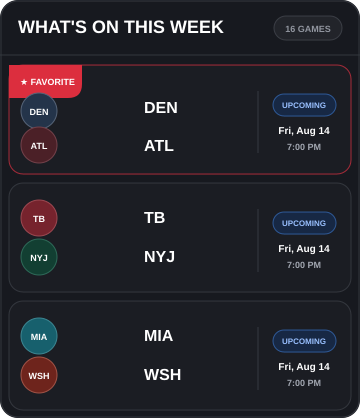
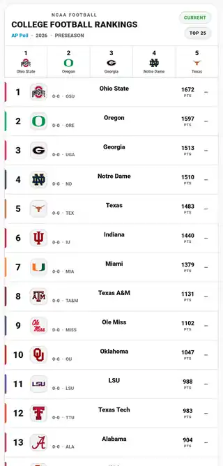

<div align="center">

# 🏟️ Sports Ticker for Home Assistant

### Turn ESPN sports data into live Home Assistant scoreboards, tickers, game cards, rankings, highlights, and team-focused dashboards.

[](https://github.com/LiquidFXX/sports-ticker/releases/latest)
[](https://github.com/LiquidFXX/sports-ticker/releases)
[](#installation)
[](https://www.home-assistant.io/)
[](LICENSE)

**Stable release:** `v0.20.1`  •  **Current main branch:** `v0.20.2-beta.1`

</div>

---

## See it in action

Sports Ticker gives Home Assistant the sports data. The included Lovelace examples show what you can build with it.

<a href="examples/NFL.md#2-scrolling-sports-ticker">
  
</a>

<p align="center">
  <a href="examples/NFL.md#1-favorite-team-next-game">
    
  </a>
  &nbsp;
  <a href="examples/NFL.md#4-this-week-in-the-nfl">
    
  </a>
  &nbsp;
  <a href="examples/CFB.md">
    
  </a>
</p>

> The integration supplies normalized ESPN data as Home Assistant sensors. The example cards are starting points—you can restyle them to match your own dashboard theme.

---

## What Sports Ticker can do

| Feature | What you get |
| :--- | :--- |
| 🏟️ **Live scoreboards** | ESPN scoreboard data for every enabled league, including events, teams, scores, status, venue, broadcasts, and game metadata where available |
| ⭐ **Favorite teams** | Select a favorite team per league and expose it directly to cards and automations |
| 📅 **Next-game sensors** | Dedicated NFL and College Football next-game entities that follow your configured favorite team |
| 🏆 **College Football rankings** | AP Top 25, Coaches Poll, CFP rankings, previous rank, trend, records, votes, points, logos, and dropped-out teams |
| 📊 **Player / team leaders** | MLB player leader sensors plus NFL per-team game leaders for passing, rushing, receiving, sacks, and tackles |
| 🎬 **Highlights** | ESPN highlight/video metadata that can power playable game recap cards |
| 📺 **Scrolling tickers** | Build single-sport or multi-sport ESPN-style tickers with your own speed and theme |
| 💾 **Failure-resistant data** | Last-good caching keeps cards populated when ESPN temporarily times out or returns bad data |
| 🧩 **Card-friendly attributes** | Raw ESPN data plus normalized helpers designed for `custom:button-card`, `card-mod`, Mushroom, and Sections dashboards |

Sports Ticker does **not** lock you into one dashboard design. It gives Home Assistant a reusable sports data layer so one integration can feed scoreboards, compact cards, wall displays, tablets, automations, and full sports dashboards.

---

## Supported sports and leagues

| Category | Leagues |
| :--- | :--- |
| ⚾ Baseball | MLB |
| 🏈 Football | NFL, College Football |
| 🏀 Basketball | NBA, WNBA |
| 🏒 Hockey | NHL |
| ⚽ Soccer | MLS, Premier League, LaLiga, Bundesliga, Serie A, Ligue 1, UEFA Champions League |
| ⛳ Golf | PGA Tour |
| 🏁 Racing | NASCAR |

More sports are planned around their seasonal calendars so support can land before each season or major competition begins.

---

## Core entities

### League scoreboards

Each selected league gets a raw scoreboard sensor:

```text
sensor.espn_<league>_scoreboard_raw
```

Examples:

```text
sensor.espn_nfl_scoreboard_raw
sensor.espn_cfb_scoreboard_raw
sensor.espn_mlb_scoreboard_raw
sensor.espn_nba_scoreboard_raw
sensor.espn_nhl_scoreboard_raw
sensor.espn_epl_scoreboard_raw
```

Typical attributes include:

```yaml
events:
  - ...
season:
day:
next:
favorite_team:
favorite_team_name:
has_favorite_team: true
ticker_speed: 12
ticker_theme: light
stale: false
source: espn
```

### Favorite-team next game

When NFL or College Football is enabled:

```text
sensor.espn_nfl_next_game
sensor.espn_cfb_next_game
```

The sensor automatically follows the favorite team selected in Sports Ticker settings.

Example state:

```text
KC @ BUF
```

Useful attributes include kickoff time, opponent, home/away, venue, broadcasts, team logos, season/week, rankings/records where available, and freshness metadata.

### College Football rankings

```text
sensor.espn_cfb_rankings
```

Card-friendly aliases include:

```yaml
ap_top_25:
  - ...
coaches_poll:
  - ...
cfp:
  - ...
```

The `cfp` list remains empty until ESPN publishes College Football Playoff rankings for the season.

### MLB player leaders

```text
sensor.espn_mlb_player_leaders_raw
```

Includes normalized leader groups such as home runs, RBI, hits, stolen bases, wins, ERA, strikeouts, and saves when ESPN provides them.

### NFL team leaders

NFL scoreboard competition objects can include normalized per-team game leaders:

```yaml
team_leaders:
  away:
    passing: ...
    rushing: ...
    receiving: ...
    sacks: ...
    tackles: ...
  home:
    passing: ...
    rushing: ...
    receiving: ...
    sacks: ...
    tackles: ...
```

Existing ESPN `leaders` data is preserved for backward compatibility.

---

## Installation

### HACS

Sports Ticker is installed as a **custom HACS integration**.

1. Open **HACS → Integrations**.
2. Open the three-dot menu and choose **Custom repositories**.
3. Add:

```text
https://github.com/LiquidFXX/sports-ticker
```

4. Select **Integration** as the category.
5. Install **Sports Ticker**.
6. Restart Home Assistant.
7. Go to **Settings → Devices & services → Add integration → Sports Ticker**.

Release builds include a `sports_ticker.zip` asset for HACS installation.

### Manual installation

Copy:

```text
custom_components/sports_ticker/
```

to:

```text
config/custom_components/sports_ticker/
```

Restart Home Assistant, then add **Sports Ticker** from **Settings → Devices & services**.

---

## Configuration

Open:

```text
Settings → Devices & services → Sports Ticker → Configure
```

Choose the leagues you want, then configure:

- **Favorite team** for each selected league
- **Poll interval** for ESPN updates
- **Ticker speed** from 4–60 seconds
- **Ticker theme** for example cards

Lower ticker-speed values move faster; higher values move slower.

---

## Lovelace examples

The `examples/` folder contains complete, copy/paste-oriented dashboard examples.

| Sport | Examples |
| :--- | :--- |
| 🏈 NFL | [Next game, scrolling ticker, highlights, weekly cards, leaders, and more](examples/NFL.md) |
| 🏈 College Football | [Rankings and College Football cards](examples/CFB.md) |
| ⚾ MLB | [Ticker, schedule, standings-style layouts, stats, and game cards](examples/MLB.md) |
| 🏀 NBA | [Schedule, ticker, and dashboard cards](examples/NBA.md) |
| 🌐 Multi-sport | [`multi_league_ticker_card.yaml`](examples/multi_league_ticker_card.yaml) |

Many examples use community frontend cards such as:

- `custom:button-card`
- `card-mod`
- Mushroom cards

Those frontend cards are optional for the integration itself; they are only required by examples that reference them.

---

## Reliability and caching

ESPN endpoints occasionally timeout, return incomplete data, or temporarily fail. Sports Ticker is designed not to blank a dashboard every time that happens.

Fresh data reports:

```yaml
stale: false
source: espn
last_successful_update: "..."
last_attempted_update: "..."
last_error: null
```

When a cached last-good result is being used:

```yaml
stale: true
source: cache
last_error: "..."
```

This makes it easy to build dashboard indicators or automations around data freshness.

---

## Current development

The stable release is **v0.20.1**. The `main` branch is currently on **v0.20.2-beta.1** with additional NFL game-leader work.

Active development also includes an **NFL standings and playoff-picture data source** on:

```text
feature/nfl-standings-playoff-picture
```

That work is being kept separate until it is ready to merge so existing entity IDs and scoreboard behavior remain backward-compatible.

Future feature lines are planned around seasonal timing, with College Basketball, Tennis, Rugby, Formula 1, AFL, Cricket, MotoGP, IndyCar, college baseball/softball, and additional sports under consideration.

---

## Troubleshooting

### A sensor is missing

Confirm that its league is enabled under **Sports Ticker → Configure**, then reload or restart Home Assistant after an integration update.

### A card is blank

Check that:

- The entity ID in the card exists.
- The entity has the expected `events` or normalized attributes.
- Required frontend cards such as `button-card` or `card-mod` are installed.
- ESPN data is not temporarily unavailable.

### The sensor says `Cached`

Sports Ticker could not retrieve a valid fresh response and is intentionally preserving the last good data instead of clearing the sensor.

### Favorite-team cards show the wrong team

Open **Sports Ticker → Configure** and verify the selected favorite for that league. Favorite-team cards and next-game sensors read that integration setting directly.

---

## Project goals

Sports Ticker is built around a few simple rules:

- **Useful Home Assistant entities first** — not just raw API dumps.
- **Backward compatibility** — new sports and sensors should be additive whenever possible.
- **No fabricated sports data** — if ESPN does not provide something reliably, it should remain unavailable rather than be guessed.
- **Dashboard-friendly normalization** — expose predictable data that is practical to use in Lovelace.
- **Graceful failures** — preserve last-good data whenever possible.

---

## Support

If Sports Ticker helps build your Home Assistant sports dashboard, starring the repository helps other users find it.

[](https://www.paypal.com/paypalme/KevinHughesPhoto)

Issues, feature requests, card ideas, and tested ESPN data improvements are welcome through the repository issue tracker.

---

<div align="center">

**Built for Home Assistant dashboards that should feel like a real sports screen.**

</div>
