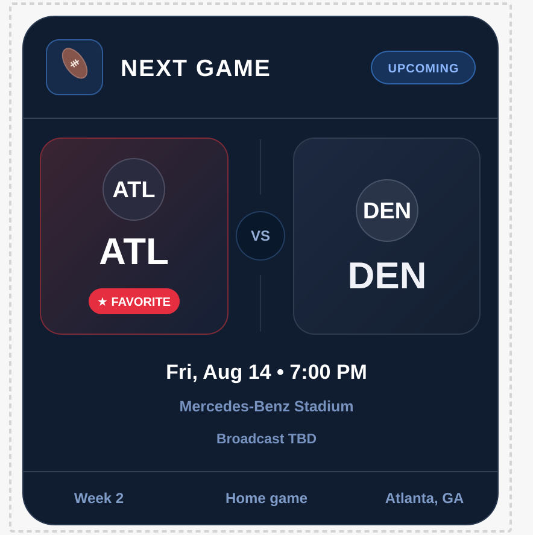

<!-- support_badges_start -->
[](https://www.paypal.com/paypalme/KevinHughesPhoto)
<!-- support_badges_end -->

# 🏈 NFL Example Layouts

Copy/paste Home Assistant dashboard examples for the **Sports Ticker** integration.

The NFL examples use the raw scoreboard sensor and the favorite-team next-game sensor:

```yaml
sensor.espn_nfl_scoreboard_raw
sensor.espn_nfl_next_game
```

## Requirements

| Requirement | Purpose |
| --- | --- |
| `sports_ticker` integration | Provides ESPN-style NFL data |
| `sensor.espn_nfl_next_game` | Favorite team's next scheduled game |
| `sensor.espn_nfl_scoreboard_raw` | Full NFL scoreboard source |
| `custom:button-card` | Required for the custom cards |
| `card-mod` | Required for advanced styling |

## 🧭 NFL Layout Options

| Layout | Best For | Sensor Used |
| --- | --- | --- |
| 1. Favorite Team Next Game | A polished featured card for the configured favorite team | `sensor.espn_nfl_next_game` |
| 2. Scrolling Sports Ticker | Compact ESPN-style scrolling scores; can mix NFL with other enabled sports | NFL and other raw scoreboard sensors |
| 3. NFL Game Highlights | Playable ESPN highlights with score and recap | `sensor.espn_nfl_scoreboard_raw` |

---

## 1. Favorite Team Next Game

A featured next-game card that automatically follows the NFL favorite selected in Sports Ticker. It shows the favorite team, opponent, kickoff date and time, venue, broadcast, week, and whether the game is home or away.



> No team abbreviation needs to be hard-coded. The card reads the configured favorite directly from `sensor.espn_nfl_next_game`.

<details>
<summary>Copy YAML</summary>

```yaml
type: custom:button-card
entity: sensor.espn_nfl_next_game

show_icon: false
show_name: false
show_state: false

tap_action:
  action: more-info

variables:
  src: sensor.espn_nfl_next_game

styles:
  card:
    - padding: 0
    - border-radius: 22px
    - overflow: hidden
    - background: rgba(8, 19, 36, 0.96)
    - border: 1px solid rgba(255, 255, 255, 0.10)
    - box-shadow: 0 18px 45px rgba(0, 0, 0, 0.30)
    - container-type: inline-size
  grid:
    - grid-template-areas: '"main"'
    - grid-template-columns: 1fr
    - grid-template-rows: auto
  custom_fields:
    main:
      - width: 100%

custom_fields:
  main: |
    [[[
      const entityId = variables.src;
      const st = states[entityId];

      const esc = (value) =>
        String(value ?? "")
          .replaceAll("&", "&amp;")
          .replaceAll("<", "&lt;")
          .replaceAll(">", "&gt;")
          .replaceAll('"', "&quot;")
          .replaceAll("'", "&#039;");

      if (!st) {
        return `
          <div class="empty">
            <div class="empty-icon">🏈</div>
            <div class="empty-title">NFL NEXT GAME</div>
            <div class="empty-sub">${esc(entityId)} is unavailable</div>
          </div>
        `;
      }

      const a = st.attributes || {};
      const favorite = String(a.favorite_team || "").trim().toUpperCase();
      const favoriteName = a.favorite_team_name || favorite || "Favorite Team";

      if (!favorite) {
        return `
          <div class="empty">
            <div class="empty-icon">⭐</div>
            <div class="empty-title">SELECT AN NFL FAVORITE</div>
            <div class="empty-sub">Choose your favorite NFL team in Sports Ticker options.</div>
          </div>
        `;
      }

      if (!a.has_upcoming_game || !a.date) {
        return `
          <div class="empty">
            <div class="empty-icon">🏈</div>
            <div class="empty-title">${esc(favoriteName)}</div>
            <div class="empty-sub">No upcoming game found</div>
            ${a.stale ? `<div class="cache-pill">CACHED DATA</div>` : ""}
          </div>
        `;
      }

      const opponent = String(a.opponent || "OPP").toUpperCase();
      const opponentName = a.opponent_name || opponent;
      const side = String(a.home_away || "").toLowerCase();

      const date = new Date(a.date);
      const validDate = !Number.isNaN(date.getTime());

      const dateText = validDate
        ? date.toLocaleDateString(undefined, {
            weekday: "short",
            month: "short",
            day: "numeric"
          })
        : "";

      const timeText = validDate
        ? date.toLocaleTimeString(undefined, {
            hour: "numeric",
            minute: "2-digit"
          })
        : "";

      const kickoff = [dateText, timeText].filter(Boolean).join(" • ");
      const venue = a.venue || "Venue TBD";
      const location = [a.venue_city, a.venue_state].filter(Boolean).join(", ");

      const broadcasts = Array.isArray(a.broadcasts)
        ? a.broadcasts.filter(Boolean)
        : [];

      const broadcast = broadcasts.length
        ? broadcasts.slice(0, 3).join(" • ")
        : "Broadcast TBD";

      const week = a.week ? `Week ${a.week}` : "NFL";
      const gameType = side === "home"
        ? "Home game"
        : side === "away"
          ? "Away game"
          : "Scheduled game";

      const centerWord = side === "away" ? "AT" : "VS";
      const status = String(a.status || "pre").toLowerCase();

      let badge = "UPCOMING";
      let badgeClass = "upcoming";

      if (status === "in") {
        badge = "LIVE";
        badgeClass = "live";
      } else if (status === "post") {
        badge = "FINAL";
        badgeClass = "final";
      }

      return `
        <div class="wrap">

          <div class="header">
            <div class="header-left">
              <div class="header-icon">🏈</div>
              <div class="title">NEXT GAME</div>
            </div>

            <div class="header-right">
              ${a.stale ? `<span class="status cached">CACHED</span>` : ""}
              <span class="status ${badgeClass}">${badge}</span>
            </div>
          </div>

          <div class="matchup">
            <div class="team favorite-team">
              <div class="team-mark">${esc(favorite)}</div>
              <div class="team-abbr">${esc(favorite)}</div>
              <div class="favorite-pill">★ FAVORITE</div>
            </div>

            <div class="versus">
              <div class="vs-line"></div>
              <div class="vs-circle">${centerWord}</div>
              <div class="vs-line"></div>
            </div>

            <div class="team opponent-team">
              <div class="team-mark">${esc(opponent)}</div>
              <div class="team-abbr opponent">${esc(opponent)}</div>
              <div class="opponent-name">${esc(opponentName)}</div>
            </div>
          </div>

          <div class="game-info">
            <div class="info-row primary">
              <span class="info-icon">📅</span>
              <span>${esc(kickoff)}</span>
            </div>

            <div class="info-row">
              <span class="info-icon">📍</span>
              <span>${esc(venue)}</span>
            </div>

            <div class="info-row">
              <span class="info-icon">📺</span>
              <span>${esc(broadcast)}</span>
            </div>
          </div>

          <div class="footer">
            <div class="footer-item">${esc(week)}</div>
            <div class="footer-divider"></div>
            <div class="footer-item">${esc(gameType)}</div>
            ${location ? `
              <div class="footer-divider"></div>
              <div class="footer-item">${esc(location)}</div>
            ` : ""}
          </div>

        </div>
      `;
    ]]]

card_mod:
  style: |
    .wrap {
      width: 100%;
      color: white;
      box-sizing: border-box;
      font-family: var(--paper-font-body1_-_font-family);
    }

    .header {
      display: flex;
      justify-content: space-between;
      align-items: center;
      gap: 16px;
      padding: clamp(20px, 4cqw, 34px);
      min-height: clamp(82px, 14cqw, 120px);
      box-sizing: border-box;
      border-bottom: 1px solid rgba(255,255,255,.11);
      background: linear-gradient(180deg, rgba(255,255,255,.025), transparent);
    }

    .header-left {
      display: flex;
      align-items: center;
      gap: clamp(14px, 2.5cqw, 22px);
      min-width: 0;
    }

    .header-icon {
      width: clamp(54px, 9cqw, 78px);
      height: clamp(54px, 9cqw, 78px);
      display: flex;
      align-items: center;
      justify-content: center;
      flex: 0 0 auto;
      border-radius: 20px;
      font-size: clamp(26px, 4.5cqw, 38px);
      background: rgba(38,91,160,.15);
      border: 1px solid rgba(80,145,235,.32);
    }

    .title {
      color: white;
      font-size: clamp(23px, 5cqw, 40px);
      font-weight: 900;
      letter-spacing: 2px;
      line-height: 1;
      white-space: nowrap;
    }

    .header-right {
      display: flex;
      align-items: center;
      gap: 7px;
      flex-wrap: wrap;
      justify-content: flex-end;
    }

    .status {
      padding: 8px 17px;
      border-radius: 999px;
      font-size: clamp(10px, 1.8cqw, 14px);
      font-weight: 900;
      letter-spacing: 1px;
      border: 1px solid rgba(255,255,255,.12);
    }

    .status.upcoming {
      color: #94bcff;
      background: rgba(35,92,180,.14);
      border-color: rgba(64,132,235,.45);
    }

    .status.live {
      color: white;
      background: rgba(225,40,52,.92);
      border-color: rgba(255,85,95,.45);
      box-shadow: 0 0 18px rgba(225,40,52,.24);
    }

    .status.final {
      color: rgba(255,255,255,.78);
      background: rgba(255,255,255,.08);
    }

    .status.cached {
      color: #ffd17a;
      background: rgba(255,175,25,.10);
      border-color: rgba(255,195,65,.28);
    }

    .matchup {
      display: grid;
      grid-template-columns: minmax(0,1fr) clamp(58px, 9cqw, 82px) minmax(0,1fr);
      align-items: stretch;
      gap: clamp(10px, 2cqw, 18px);
      padding: clamp(26px, 5cqw, 40px) clamp(18px, 4cqw, 30px) 18px;
    }

    .team {
      min-width: 0;
      min-height: clamp(230px, 38cqw, 330px);
      padding: clamp(18px, 3.5cqw, 28px);
      box-sizing: border-box;
      display: flex;
      flex-direction: column;
      align-items: center;
      justify-content: center;
      border-radius: 28px;
      border: 1px solid rgba(255,255,255,.10);
      background: rgba(255,255,255,.025);
    }

    .favorite-team {
      background: radial-gradient(circle at top left, rgba(206,40,55,.16), transparent 65%), rgba(255,255,255,.02);
      border-color: rgba(221,51,64,.46);
    }

    .opponent-team {
      background: radial-gradient(circle at top right, rgba(66,105,170,.14), transparent 62%), rgba(255,255,255,.02);
    }

    .team-mark {
      width: clamp(66px, 11cqw, 90px);
      height: clamp(66px, 11cqw, 90px);
      display: flex;
      align-items: center;
      justify-content: center;
      border-radius: 50%;
      color: white;
      background: rgba(255,255,255,.065);
      border: 1px solid rgba(255,255,255,.16);
      font-size: clamp(18px, 3.5cqw, 28px);
      font-weight: 900;
    }

    .team-abbr {
      margin-top: clamp(20px, 3.5cqw, 30px);
      color: white;
      font-size: clamp(38px, 8cqw, 66px);
      font-weight: 900;
      line-height: 1;
      letter-spacing: 1px;
    }

    .team-abbr.opponent {
      color: rgba(240,243,250,.94);
    }

    .favorite-pill {
      margin-top: clamp(20px, 3cqw, 26px);
      padding: 6px 12px;
      border-radius: 999px;
      color: white;
      background: linear-gradient(180deg, #ef3f4e, #c92232);
      font-size: clamp(9px, 1.6cqw, 12px);
      font-weight: 900;
      letter-spacing: .6px;
    }

    .opponent-name {
      margin-top: 9px;
      max-width: 100%;
      color: rgba(200,214,238,.50);
      font-size: clamp(9px, 1.5cqw, 12px);
      font-weight: 650;
      text-align: center;
      white-space: nowrap;
      overflow: hidden;
      text-overflow: ellipsis;
    }

    .versus {
      min-width: 0;
      display: flex;
      flex-direction: column;
      align-items: center;
      justify-content: center;
      gap: 12px;
    }

    .vs-line {
      width: 1px;
      flex: 1;
      min-height: 35px;
      background: linear-gradient(transparent, rgba(255,255,255,.13), transparent);
    }

    .vs-circle {
      width: clamp(52px, 8cqw, 72px);
      height: clamp(52px, 8cqw, 72px);
      flex: 0 0 auto;
      display: flex;
      align-items: center;
      justify-content: center;
      border-radius: 50%;
      color: #9cb3db;
      background: rgba(4,15,30,.76);
      border: 1px solid rgba(95,145,220,.22);
      font-size: clamp(12px, 2.4cqw, 18px);
      font-weight: 900;
      letter-spacing: 1px;
    }

    .game-info {
      display: flex;
      flex-direction: column;
      align-items: center;
      gap: 12px;
      padding: 10px clamp(18px, 4cqw, 32px) clamp(26px, 4cqw, 38px);
    }

    .info-row {
      display: flex;
      align-items: center;
      justify-content: center;
      gap: 12px;
      max-width: 100%;
      color: #728bb5;
      font-size: clamp(12px, 2.1cqw, 17px);
      font-weight: 700;
      text-align: center;
    }

    .info-row.primary {
      color: white;
      font-size: clamp(19px, 4cqw, 30px);
      font-weight: 900;
    }

    .info-icon {
      flex: 0 0 auto;
      opacity: .75;
    }

    .footer {
      display: flex;
      align-items: center;
      justify-content: space-around;
      gap: clamp(10px, 2cqw, 22px);
      padding: clamp(19px, 3cqw, 26px) clamp(14px, 3cqw, 26px);
      border-top: 1px solid rgba(255,255,255,.10);
      background: rgba(255,255,255,.018);
    }

    .footer-item {
      min-width: 0;
      color: #7f9bc7;
      font-size: clamp(11px, 2cqw, 15px);
      font-weight: 800;
      text-align: center;
      white-space: nowrap;
    }

    .footer-divider {
      width: 1px;
      height: 30px;
      flex: 0 0 auto;
      background: rgba(255,255,255,.08);
    }

    .empty {
      min-height: 240px;
      padding: 35px 20px;
      box-sizing: border-box;
      display: flex;
      flex-direction: column;
      align-items: center;
      justify-content: center;
      text-align: center;
    }

    .empty-icon {
      font-size: 38px;
    }

    .empty-title {
      margin-top: 12px;
      color: white;
      font-size: clamp(18px, 4cqw, 28px);
      font-weight: 900;
      letter-spacing: 1px;
    }

    .empty-sub {
      margin-top: 7px;
      color: rgba(200,215,238,.60);
      font-size: 13px;
      font-weight: 600;
    }

    .cache-pill {
      margin-top: 15px;
      padding: 5px 10px;
      border-radius: 999px;
      color: #ffce73;
      background: rgba(255,170,20,.10);
      border: 1px solid rgba(255,190,60,.24);
      font-size: 10px;
      font-weight: 900;
      letter-spacing: .8px;
    }

    @container (max-width: 520px) {
      .header {
        padding: 16px;
        min-height: 82px;
      }

      .header-icon {
        width: 46px;
        height: 46px;
        border-radius: 15px;
      }

      .title {
        font-size: 22px;
      }

      .status {
        padding: 6px 11px;
      }

      .matchup {
        padding: 20px 10px 12px;
        grid-template-columns: minmax(0,1fr) 46px minmax(0,1fr);
        gap: 6px;
      }

      .team {
        min-height: 190px;
        padding: 14px 7px;
        border-radius: 20px;
      }

      .team-mark {
        width: 56px;
        height: 56px;
      }

      .team-abbr {
        margin-top: 18px;
        font-size: 38px;
      }

      .favorite-pill {
        margin-top: 16px;
        padding: 5px 8px;
        font-size: 8px;
      }

      .opponent-name {
        display: none;
      }

      .vs-circle {
        width: 42px;
        height: 42px;
        font-size: 11px;
      }

      .game-info {
        padding: 12px 12px 24px;
      }

      .footer {
        padding: 16px 8px;
      }

      .footer-divider {
        display: none;
      }
    }
```

</details>

---

## 2. Scrolling Sports Ticker

A compact ESPN-style scrolling ticker for NFL scores and schedules. The same reusable card can be stacked for other enabled leagues, which makes it possible to build a multi-sport ticker like the preview below.


The full reusable card is also stored in [`multi_league_ticker_card.yaml`](multi_league_ticker_card.yaml).

<details>
<summary>Copy YAML</summary>

```yaml
# ==============================================================
# SPORTS TICKER - MULTI-SPORT SCROLLING CARD
#
# NEW USER NOTES
# --------------------------------------------------------------
# Requirements:
#   - Sports Ticker integration
#   - custom:button-card
#   - card-mod
#
# The `sports:` list below controls which leagues actually appear
# in the scrolling ticker. Add one block for each league you want.
#
# Common `kind` values:
#   football   -> NFL / college football style clock + alerts
#   baseball   -> MLB style inning display + baseball alerts
#   basketball -> NBA/WNBA style quarter + clock
#   hockey     -> NHL style period + clock
#   generic    -> fallback for other sports
#
# `teams: null` means show every game for that league.
# To limit a league to specific teams, use abbreviations, for example:
#   teams:
#     - ATL
#     - TB
#
# `enabled: false` hides a league without deleting its config.
#
# `seconds_per_game` controls ticker speed:
#   higher number = slower scrolling
#   lower number  = faster scrolling
#
# `highlight_favorite: true` adds a favorite marker when the
# scoreboard sensor exposes a matching `favorite_team` attribute.
#
# Alerts can be disabled globally with:
#   alerts:
#     enabled: false
#
# IMPORTANT FOR THIS EXAMPLE:
# The supplied configuration below currently has MLB as the active
# entry under `sports:`. To display NFL as well, add this block:
#
#   - label: NFL
#     entity: sensor.espn_nfl_scoreboard_raw
#     kind: football
#     accent: '#2563eb'
#     enabled: true
#     teams: null
# ==============================================================

type: custom:button-card

# This entity is used for the card's more-info action.
# The leagues displayed in the ticker are controlled by `variables.sports`.
entity: sensor.espn_nfl_scoreboard_raw

show_name: false
show_icon: false
show_state: false

# Re-render when Home Assistant states change so scores/status stay current.
triggers_update: all

tap_action:
  action: more-info

# Optional dashboard sizing. Adjust/remove if your dashboard layout
# does not use grid_options.
grid_options:
  columns: 50
  rows: auto

variables:

  # ------------------------------------------------------------
  # LEAGUES TO DISPLAY
  # Add one block per league.
  # ------------------------------------------------------------
  sports:

    # Active example from the supplied YAML.
    - label: MLB
      entity: sensor.espn_mlb_scoreboard_raw
      kind: baseball
      accent: '#ef4444'
      enabled: true

      # null = all teams.
      # Or use a list such as: [ATL, NYY]
      teams: null

    # Example NFL block - remove the leading # characters to enable.
    #
    # - label: NFL
    #   entity: sensor.espn_nfl_scoreboard_raw
    #   kind: football
    #   accent: '#2563eb'
    #   enabled: true
    #   teams: null

  # Approximate amount of scroll time allocated per game.
  # Increase this to slow the ticker down.
  seconds_per_game: 8

  # Set true to visually mark games involving the configured favorite team.
  highlight_favorite: false

  # ------------------------------------------------------------
  # SPECIAL GAME ALERTS
  #
  # Set any individual option to false to disable that alert.
  # Set `enabled: false` to disable all special alerts.
  # ------------------------------------------------------------
  alerts:
    enabled: true

    baseball:
      # No-hit/perfect-game alerts are only considered at or after
      # this inning.
      minimum_inning: 7
      no_hit_bid: true
      perfect_game_bid: true
      extra_innings: true
      tied_late: true
      close_late: true

    football:
      overtime: true
      red_zone: true
      tied_late: true
      close_late: true

    basketball:
      overtime: true
      tied_late: true
      close_late: true

    hockey:
      overtime: true
      tied_late: true
      close_late: true
styles:
  card:
    - padding: 0
    - border-radius: 18px
    - overflow: hidden
    - border: 1px solid rgba(255,255,255,0.13)
    - background: rgba(12,18,28,0.64)
    - box-shadow: 0 8px 28px rgba(0,0,0,0.18)
    - backdrop-filter: blur(20px) saturate(145%)
    - -webkit-backdrop-filter: blur(20px) saturate(145%)
    - container-type: inline-size
  grid:
    - grid-template-areas: '"ticker"'
    - grid-template-columns: 1fr
    - grid-template-rows: auto
  custom_fields:
    ticker:
      - width: 100%
      - overflow: hidden
custom_fields:
  ticker: |
    [[[
      const sports =
        Array.isArray(variables.sports)
          ? variables.sports
          : [];

      const alertConfig =
        variables.alerts || {};

      const alertsEnabled =
        !(
          alertConfig.enabled === false ||
          String(
            alertConfig.enabled
          ).toLowerCase() === "false"
        );

      const highlightFavorite =
        !(
          variables.highlight_favorite === false ||
          String(
            variables.highlight_favorite
          ).toLowerCase() === "false"
        );


      /*
       * ========================================================
       * HELPERS
       * ========================================================
       */

      const esc = value =>
        String(value ?? "")
          .replaceAll("&", "&amp;")
          .replaceAll("<", "&lt;")
          .replaceAll(">", "&gt;")
          .replaceAll('"', "&quot;")
          .replaceAll("'", "&#039;");


      const normalizeTeam = value =>
        String(value ?? "")
          .trim()
          .toUpperCase();


      const boolEnabled = value =>
        !(
          value === false ||
          String(value).toLowerCase() === "false"
        );


      const numberValue = value => {

        if (
          value === null ||
          value === undefined ||
          value === ""
        ) {
          return null;
        }

        const n =
          Number.parseFloat(value);

        return Number.isFinite(n)
          ? n
          : null;
      };


      const parseClockSeconds = clock => {

        const text =
          String(clock || "")
            .trim();

        const match =
          text.match(
            /^(\d+):(\d{1,2})$/
          );

        if (!match)
          return null;

        return (
          Number(match[1]) * 60 +
          Number(match[2])
        );
      };


      const getLogo = team =>
        team?.logo ||
        team?.logos?.[0]?.href ||
        team?.logos?.[0]?.url ||
        "";


      /*
       * Try to locate team statistics regardless of
       * whether ESPN stores them under statistics,
       * stats, or directly on the competitor.
       */

      const readTeamStat = (
        competitor,
        names
      ) => {

        const wanted =
          names.map(
            name =>
              String(name)
                .toLowerCase()
                .replace(
                  /[^a-z0-9]/g,
                  ""
                )
          );


        const directSources = [
          competitor,
          competitor?.team
        ];


        for (
          const source
          of directSources
        ) {

          if (!source)
            continue;


          for (
            const key
            of Object.keys(source)
          ) {

            const normalized =
              key
                .toLowerCase()
                .replace(
                  /[^a-z0-9]/g,
                  ""
                );


            if (
              wanted.includes(
                normalized
              )
            ) {

              const n =
                numberValue(
                  source[key]
                );

              if (n !== null)
                return n;
            }
          }
        }


        const collections = [
          competitor?.statistics,
          competitor?.stats,
          competitor?.team?.statistics,
          competitor?.team?.stats
        ];


        for (
          const collection
          of collections
        ) {

          if (
            !Array.isArray(
              collection
            )
          ) {
            continue;
          }


          for (
            const stat
            of collection
          ) {

            const namesToCheck = [

              stat?.name,

              stat?.abbreviation,

              stat?.shortDisplayName,

              stat?.displayName,

              stat?.label

            ]
              .filter(Boolean)
              .map(
                name =>
                  String(name)
                    .toLowerCase()
                    .replace(
                      /[^a-z0-9]/g,
                      ""
                    )
              );


            if (
              !namesToCheck.some(
                name =>
                  wanted.includes(name)
              )
            ) {
              continue;
            }


            const candidate =
              stat?.value ??
              stat?.displayValue ??
              stat?.summary;


            const n =
              numberValue(
                candidate
              );


            if (n !== null)
              return n;
          }
        }


        return null;
      };


      const logoHtml = (
        url,
        abbreviation
      ) => {

        if (!url) {

          return `
            <div
              class="team-logo-shell"
              title="${esc(abbreviation)}"
            >

              <div class="logo-fallback">
                ${esc(abbreviation)}
              </div>

            </div>
          `;
        }


        return `
          <div
            class="team-logo-shell"
            title="${esc(abbreviation)}"
          >

            

            <div
              class="logo-fallback"
              style="display:none"
            >
              ${esc(abbreviation)}
            </div>

          </div>
        `;
      };


      const formatKickoff = raw => {

        if (!raw)
          return "";

        const d =
          new Date(raw);

        if (
          Number.isNaN(
            d.getTime()
          )
        ) {
          return "";
        }


        const now =
          new Date();


        const today =
          d.toDateString() ===
          now.toDateString();


        const tomorrowDate =
          new Date(now);

        tomorrowDate.setDate(
          now.getDate() + 1
        );


        const tomorrow =
          d.toDateString() ===
          tomorrowDate.toDateString();


        let day;


        if (today) {

          day = "TODAY";

        }

        else if (tomorrow) {

          day = "TOM";

        }

        else {

          day =
            d.toLocaleDateString(
              undefined,
              {
                weekday: "short"
              }
            )
              .toUpperCase();
        }


        const time =
          d.toLocaleTimeString(
            undefined,
            {
              hour: "numeric",
              minute: "2-digit"
            }
          );


        return `${day} ${time}`;
      };


      /*
       * ========================================================
       * PERIOD HELPERS
       * ========================================================
       */

      const footballPeriod = period => {

        const p =
          Number(period || 0);

        if (!p)
          return "";

        if (p <= 4)
          return `Q${p}`;

        if (p === 5)
          return "OT";

        return `${p - 4}OT`;
      };


      const basketballPeriod = period => {

        const p =
          Number(period || 0);

        if (!p)
          return "";

        if (p <= 4)
          return `Q${p}`;

        return "OT";
      };


      const hockeyPeriod = period => {

        const p =
          Number(period || 0);

        if (!p)
          return "";

        if (p === 1)
          return "1ST";

        if (p === 2)
          return "2ND";

        if (p === 3)
          return "3RD";

        return "OT";
      };


      const baseballDetail = detail => {

        const text =
          String(
            detail || ""
          ).trim();


        const match =
          text.match(
            /^(Top|Bot|Bottom|Mid|End)\s+(\d+)/i
          );


        if (!match)
          return text.toUpperCase();


        const half =
          match[1].toLowerCase();

        const inning =
          match[2];


        if (half === "top")
          return `▲ TOP ${inning}`;


        if (
          half === "bot" ||
          half === "bottom"
        ) {
          return `▼ BOT ${inning}`;
        }


        if (half === "mid")
          return `MID ${inning}`;


        if (half === "end")
          return `END ${inning}`;


        return text.toUpperCase();
      };


      const baseballInning = game => {

        const period =
          Number(
            game?.status?.period || 0
          );


        if (period)
          return period;


        const detail =
          String(
            game?.type?.shortDetail ||
            game?.type?.detail ||
            ""
          );


        const match =
          detail.match(
            /(Top|Bot|Bottom|Mid|End)\s+(\d+)/i
          );


        return match
          ? Number(match[2])
          : 0;
      };


      const liveDetail = (
        kind,
        status,
        type
      ) => {

        const period =
          status?.period || 0;

        const clock =
          status?.displayClock || "";

        const shortDetail =
          type?.shortDetail ||
          type?.detail ||
          "";


        switch (
          String(kind || "")
            .toLowerCase()
        ) {

          case "football":

            return [
              footballPeriod(period),
              clock
            ]
              .filter(Boolean)
              .join(" ");


          case "basketball":

            return [
              basketballPeriod(period),
              clock
            ]
              .filter(Boolean)
              .join(" ");


          case "hockey":

            return [
              hockeyPeriod(period),
              clock
            ]
              .filter(Boolean)
              .join(" ");


          case "baseball":

            return baseballDetail(
              shortDetail
            );


          default:

            return (
              shortDetail ||
              clock ||
              "IN PROGRESS"
            );
        }
      };


      /*
       * ========================================================
       * ALERT ENGINE
       * ========================================================
       */

      const gameAlert = (
        game,
        group
      ) => {

        if (!alertsEnabled)
          return null;


        if (
          game.state !== "in" &&
          game.state !== "post"
        ) {
          return null;
        }


        const kind =
          String(
            group.kind || ""
          ).toLowerCase();


        const awayScore =
          numberValue(
            game.awayScore
          );

        const homeScore =
          numberValue(
            game.homeScore
          );


        const scoreDiff =
          (
            awayScore !== null &&
            homeScore !== null
          )
            ? Math.abs(
                awayScore -
                homeScore
              )
            : null;


        const tied =
          (
            awayScore !== null &&
            homeScore !== null &&
            awayScore === homeScore
          );


        /*
         * ------------------------------------------------------
         * BASEBALL
         * ------------------------------------------------------
         */

        if (kind === "baseball") {

          const cfg =
            alertConfig.baseball ||
            {};


          const inning =
            baseballInning(game);


          const minimumInning =
            Math.max(
              1,
              Number(
                cfg.minimum_inning ||
                7
              )
            );


          const awayHits =
            readTeamStat(
              game.awayRaw,
              [
                "hits",
                "H"
              ]
            );


          const homeHits =
            readTeamStat(
              game.homeRaw,
              [
                "hits",
                "H"
              ]
            );


          /*
           * Conservative perfect-game support.
           *
           * We only use an explicit "times reached base"
           * style statistic. We DO NOT infer a perfect
           * game merely from zero hits.
           */

          const awayReached =
            readTeamStat(
              game.awayRaw,
              [
                "timesReachedBase",
                "timesOnBase",
                "reachedBaseCount",
                "battersReachedBase"
              ]
            );


          const homeReached =
            readTeamStat(
              game.homeRaw,
              [
                "timesReachedBase",
                "timesOnBase",
                "reachedBaseCount",
                "battersReachedBase"
              ]
            );


          const perfectBid =
            (
              inning >=
                minimumInning
            ) &&
            (
              (
                awayHits === 0 &&
                awayReached === 0
              ) ||
              (
                homeHits === 0 &&
                homeReached === 0
              )
            );


          const noHitBid =
            (
              inning >=
                minimumInning
            ) &&
            (
              awayHits === 0 ||
              homeHits === 0
            );


          /*
           * PERFECT GAME
           */

          if (
            boolEnabled(
              cfg.perfect_game_bid
            ) &&
            perfectBid
          ) {

            if (
              game.state === "post" &&
              inning >= 9
            ) {

              return {
                level: "elite",
                icon: "◆",
                text: "PERFECT GAME"
              };
            }


            if (
              game.state === "in"
            ) {

              return {
                level: "elite",
                icon: "◆",
                text: "PERFECT GAME BID"
              };
            }
          }


          /*
           * NO-HITTER
           */

          if (
            boolEnabled(
              cfg.no_hit_bid
            ) &&
            noHitBid
          ) {

            if (
              game.state === "post" &&
              inning >= 9
            ) {

              return {
                level: "hot",
                icon: "🔥",
                text: "NO-HITTER"
              };
            }


            if (
              game.state === "in"
            ) {

              return {
                level: "hot",
                icon: "🔥",
                text: "NO-HIT BID"
              };
            }
          }


          /*
           * EXTRA INNINGS
           */

          if (
            game.state === "in" &&
            inning >= 10 &&
            boolEnabled(
              cfg.extra_innings
            )
          ) {

            return {
              level: "watch",
              icon: "⚡",
              text: "EXTRA INNINGS"
            };
          }


          /*
           * TIED LATE
           */

          if (
            game.state === "in" &&
            inning >= 8 &&
            tied &&
            boolEnabled(
              cfg.tied_late
            )
          ) {

            return {
              level: "hot",
              icon: "🔥",
              text: "TIED LATE"
            };
          }


          /*
           * ONE-RUN GAME
           */

          if (
            game.state === "in" &&
            inning >= 8 &&
            scoreDiff === 1 &&
            boolEnabled(
              cfg.close_late
            )
          ) {

            return {
              level: "watch",
              icon: "⚡",
              text: "ONE-RUN GAME"
            };
          }
        }


        /*
         * ------------------------------------------------------
         * FOOTBALL
         * ------------------------------------------------------
         */

        if (kind === "football") {

          const cfg =
            alertConfig.football ||
            {};


          const period =
            Number(
              game.status?.period ||
              0
            );


          const clockSeconds =
            parseClockSeconds(
              game.status?.displayClock
            );


          const situation =
            game.comp?.situation ||
            game.event?.situation ||
            {};


          const redZone =
            situation?.isRedZone === true ||
            situation?.redZone === true ||
            situation?.is_red_zone === true;


          if (
            game.state === "in" &&
            period >= 5 &&
            boolEnabled(
              cfg.overtime
            )
          ) {

            return {
              level: "elite",
              icon: "⚡",
              text: "OVERTIME"
            };
          }


          if (
            game.state === "in" &&
            redZone &&
            boolEnabled(
              cfg.red_zone
            )
          ) {

            return {
              level: "hot",
              icon: "●",
              text: "RED ZONE"
            };
          }


          if (
            game.state === "in" &&
            period === 4 &&
            clockSeconds !== null &&
            clockSeconds <= 300 &&
            tied &&
            boolEnabled(
              cfg.tied_late
            )
          ) {

            return {
              level: "hot",
              icon: "🔥",
              text: "TIED LATE"
            };
          }


          if (
            game.state === "in" &&
            period === 4 &&
            clockSeconds !== null &&
            clockSeconds <= 300 &&
            scoreDiff !== null &&
            scoreDiff <= 8 &&
            boolEnabled(
              cfg.close_late
            )
          ) {

            return {
              level: "watch",
              icon: "⚡",
              text: "ONE-SCORE GAME"
            };
          }
        }


        /*
         * ------------------------------------------------------
         * BASKETBALL
         * ------------------------------------------------------
         */

        if (kind === "basketball") {

          const cfg =
            alertConfig.basketball ||
            {};


          const period =
            Number(
              game.status?.period ||
              0
            );


          const clockSeconds =
            parseClockSeconds(
              game.status?.displayClock
            );


          if (
            game.state === "in" &&
            period >= 5 &&
            boolEnabled(
              cfg.overtime
            )
          ) {

            return {
              level: "elite",
              icon: "⚡",
              text: "OVERTIME"
            };
          }


          if (
            game.state === "in" &&
            period === 4 &&
            clockSeconds !== null &&
            clockSeconds <= 120 &&
            tied &&
            boolEnabled(
              cfg.tied_late
            )
          ) {

            return {
              level: "hot",
              icon: "🔥",
              text: "TIED LATE"
            };
          }


          if (
            game.state === "in" &&
            period === 4 &&
            clockSeconds !== null &&
            clockSeconds <= 120 &&
            scoreDiff !== null &&
            scoreDiff <= 3 &&
            boolEnabled(
              cfg.close_late
            )
          ) {

            return {
              level: "watch",
              icon: "⚡",
              text: "ONE-POSSESSION GAME"
            };
          }
        }


        /*
         * ------------------------------------------------------
         * HOCKEY
         * ------------------------------------------------------
         */

        if (kind === "hockey") {

          const cfg =
            alertConfig.hockey ||
            {};


          const period =
            Number(
              game.status?.period ||
              0
            );


          const clockSeconds =
            parseClockSeconds(
              game.status?.displayClock
            );


          if (
            game.state === "in" &&
            period >= 4 &&
            boolEnabled(
              cfg.overtime
            )
          ) {

            return {
              level: "elite",
              icon: "⚡",
              text: "OVERTIME"
            };
          }


          if (
            game.state === "in" &&
            period === 3 &&
            clockSeconds !== null &&
            clockSeconds <= 300 &&
            tied &&
            boolEnabled(
              cfg.tied_late
            )
          ) {

            return {
              level: "hot",
              icon: "🔥",
              text: "TIED LATE"
            };
          }


          if (
            game.state === "in" &&
            period === 3 &&
            clockSeconds !== null &&
            clockSeconds <= 300 &&
            scoreDiff === 1 &&
            boolEnabled(
              cfg.close_late
            )
          ) {

            return {
              level: "watch",
              icon: "⚡",
              text: "ONE-GOAL GAME"
            };
          }
        }


        return null;
      };


      const alertHtml = alert => {

        if (!alert)
          return "";


        return `
          <span
            class="
              special-alert
              alert-${esc(alert.level)}
            "
          >

            <span class="alert-icon">
              ${esc(alert.icon)}
            </span>

            <span>
              ${esc(alert.text)}
            </span>

          </span>
        `;
      };


      /*
       * ========================================================
       * BUILD LEAGUE GROUPS
       * ========================================================
       */

      const groups = [];


      sports.forEach(
        (sport, sportIndex) => {

          const enabled =
            !(
              sport?.enabled === false ||
              String(
                sport?.enabled
              ).toLowerCase() === "false"
            );


          if (!enabled)
            return;


          const entityId =
            sport?.entity || "";


          if (!entityId)
            return;


          const st =
            states[entityId];


          if (
            !st ||
            st.state === "unavailable" ||
            st.state === "unknown"
          ) {
            return;
          }


          const attrs =
            st.attributes || {};


          const events =
            Array.isArray(
              attrs.events
            )
              ? attrs.events
              : [];


          if (!events.length)
            return;


          const selectedTeams =
            Array.isArray(
              sport?.teams
            )
              ? sport.teams
                  .map(
                    team =>
                      normalizeTeam(team)
                  )
                  .filter(Boolean)
              : [];


          const favorite =
            normalizeTeam(
              attrs.favorite_team || ""
            );


          let games =
            events.map(
              (event, eventIndex) => {

                const comp =
                  event?.competitions?.[0] ||
                  {};


                const competitors =
                  Array.isArray(
                    comp.competitors
                  )
                    ? comp.competitors
                    : [];


                const away =
                  competitors.find(
                    team =>
                      team?.homeAway === "away"
                  ) || {};


                const home =
                  competitors.find(
                    team =>
                      team?.homeAway === "home"
                  ) || {};


                const awayTeam =
                  away?.team || {};


                const homeTeam =
                  home?.team || {};


                const awayAbbr =
                  awayTeam?.abbreviation ||
                  awayTeam?.shortDisplayName ||
                  "AWY";


                const homeAbbr =
                  homeTeam?.abbreviation ||
                  homeTeam?.shortDisplayName ||
                  "HOM";


                const awayKey =
                  normalizeTeam(
                    awayAbbr
                  );


                const homeKey =
                  normalizeTeam(
                    homeAbbr
                  );


                const status =
                  comp?.status ||
                  event?.status ||
                  {};


                const type =
                  status?.type || {};


                const state =
                  String(
                    type?.state || "pre"
                  ).toLowerCase();


                const start =
                  comp?.date ||
                  event?.date ||
                  "";


                const isFavorite =
                  !!favorite &&
                  (
                    awayKey === favorite ||
                    homeKey === favorite
                  );


                return {

                  awayAbbr,
                  homeAbbr,

                  awayKey,
                  homeKey,

                  awayLogo:
                    getLogo(
                      awayTeam
                    ),

                  homeLogo:
                    getLogo(
                      homeTeam
                    ),

                  awayScore:
                    away?.score ?? "",

                  homeScore:
                    home?.score ?? "",

                  awayRaw:
                    away,

                  homeRaw:
                    home,

                  comp,
                  event,

                  status,
                  type,
                  state,
                  start,
                  isFavorite,
                  eventIndex
                };
              }
            );


          /*
           * ====================================================
           * TEAM FILTER
           * ====================================================
           */

          if (
            selectedTeams.length
          ) {

            games =
              games.filter(
                game =>
                  selectedTeams.includes(
                    game.awayKey
                  ) ||
                  selectedTeams.includes(
                    game.homeKey
                  )
              );
          }


          if (!games.length)
            return;


          games.sort(
            (a, b) =>
              new Date(
                a.start || 0
              ) -
              new Date(
                b.start || 0
              )
          );


          groups.push({

            label:
              sport?.label ||
              "SPORT",

            kind:
              sport?.kind ||
              "generic",

            accent:
              sport?.accent ||
              "#64748b",

            index:
              sportIndex,

            games
          });

        }
      );


      /*
       * ========================================================
       * EMPTY
       * ========================================================
       */

      if (!groups.length) {

        return `
          <div class="ticker-shell">

            <div class="league-label">

              <div
                class="league-name"
                style="
                  opacity:1;
                  visibility:visible;
                  --league-accent:#64748b;
                "
              >

                <span class="league-text">
                  SPORTS
                </span>

              </div>

            </div>


            <div class="ticker-message">
              No matching games available
            </div>

          </div>
        `;
      }


      /*
       * ========================================================
       * TIMING
       * ========================================================
       */

      const totalGames =
        groups.reduce(
          (sum, group) =>
            sum +
            group.games.length,
          0
        );


      const secondsPerGame =
        Math.max(
          1.5,
          Number(
            variables.seconds_per_game ||
            3.5
          )
        );


      const duration =
        Math.max(
          16,
          totalGames *
          secondsPerGame
        );


      /*
       * ========================================================
       * GAME RENDERER
       * ========================================================
       */

      const renderGame = (
        game,
        group
      ) => {

        const emphasizeFavorite =
          game.isFavorite &&
          highlightFavorite;


        const specialAlert =
          gameAlert(
            game,
            group
          );


        /*
         * ------------------------------------------------------
         * LIVE
         * ------------------------------------------------------
         */

        if (
          game.state === "in"
        ) {

          const detail =
            liveDetail(
              group.kind,
              game.status,
              game.type
            );


          return `
            <div
              class="
                ticker-game
                live
                ${
                  specialAlert
                    ? "has-alert"
                    : ""
                }
                ${
                  emphasizeFavorite
                    ? "favorite"
                    : ""
                }
              "
            >

              ${
                emphasizeFavorite
                  ? `
                    <span class="favorite-star">
                      ★
                    </span>
                  `
                  : ""
              }


              ${logoHtml(
                game.awayLogo,
                game.awayAbbr
              )}


              <span class="score">
                ${esc(
                  game.awayScore
                )}
              </span>


              <span class="score-separator">
                –
              </span>


              ${logoHtml(
                game.homeLogo,
                game.homeAbbr
              )}


              <span class="score">
                ${esc(
                  game.homeScore
                )}
              </span>


              ${
                specialAlert
                  ? alertHtml(
                      specialAlert
                    )
                  : `
                    <span class="live-status">

                      <span class="live-dot">
                      </span>

                      <span>
                        LIVE
                      </span>

                      ${
                        detail
                          ? `
                            <span class="status-detail">
                              ${esc(detail)}
                            </span>
                          `
                          : ""
                      }

                    </span>
                  `
              }

            </div>
          `;
        }


        /*
         * ------------------------------------------------------
         * FINAL
         * ------------------------------------------------------
         */

        if (
          game.state === "post"
        ) {

          return `
            <div
              class="
                ticker-game
                final
                ${
                  specialAlert
                    ? "has-alert"
                    : ""
                }
                ${
                  emphasizeFavorite
                    ? "favorite"
                    : ""
                }
              "
            >

              ${
                emphasizeFavorite
                  ? `
                    <span class="favorite-star">
                      ★
                    </span>
                  `
                  : ""
              }


              ${logoHtml(
                game.awayLogo,
                game.awayAbbr
              )}


              <span class="score">
                ${esc(
                  game.awayScore
                )}
              </span>


              <span class="score-separator">
                –
              </span>


              ${logoHtml(
                game.homeLogo,
                game.homeAbbr
              )}


              <span class="score">
                ${esc(
                  game.homeScore
                )}
              </span>


              ${
                specialAlert
                  ? alertHtml(
                      specialAlert
                    )
                  : `
                    <span class="final-status">
                      FINAL
                    </span>
                  `
              }

            </div>
          `;
        }


        /*
         * ------------------------------------------------------
         * UPCOMING
         * ------------------------------------------------------
         */

        return `
          <div
            class="
              ticker-game
              upcoming
              ${
                emphasizeFavorite
                  ? "favorite"
                  : ""
              }
            "
          >

            ${
              emphasizeFavorite
                ? `
                  <span class="favorite-star">
                    ★
                  </span>
                `
                : ""
            }


            ${logoHtml(
              game.awayLogo,
              game.awayAbbr
            )}


            <span class="at">
              @
            </span>


            ${logoHtml(
              game.homeLogo,
              game.homeAbbr
            )}


            <span class="kickoff">
              ${esc(
                formatKickoff(
                  game.start
                )
              )}
            </span>

          </div>
        `;
      };


      /*
       * ========================================================
       * ALL GAMES
       * ========================================================
       */

      const allGames =
        groups
          .map(
            group =>
              group.games
                .map(
                  game =>
                    renderGame(
                      game,
                      group
                    )
                )
                .join("")
          )
          .join("");


      /*
       * ========================================================
       * LEAGUE LABEL TIMING
       * ========================================================
       */

      let gameOffset = 0;

      const labelHtml = [];

      const labelCss = [];


      groups.forEach(
        (group, index) => {

          const startPct =
            (
              gameOffset /
              totalGames
            ) * 100;


          const endPct =
            (
              (
                gameOffset +
                group.games.length
              ) /
              totalGames
            ) * 100;


          const fade =
            Math.min(
              0.30,
              Math.max(
                0.04,
                (
                  100 /
                  totalGames
                ) * 0.06
              )
            );


          const beforeStart =
            Math.max(
              0,
              startPct - fade
            );


          const afterStart =
            Math.min(
              100,
              startPct + fade
            );


          const beforeEnd =
            Math.max(
              0,
              endPct - fade
            );


          const afterEnd =
            Math.min(
              100,
              endPct + fade
            );


          labelHtml.push(`
            <div
              class="
                league-name
                league-${index}
              "
              style="
                --league-accent:
                  ${esc(group.accent)};
              "
            >

              <span class="league-text">
                ${esc(group.label)}
              </span>

            </div>
          `);


          if (index === 0) {

            labelCss.push(`
              @keyframes league-label-${index} {

                0%,
                ${beforeEnd}% {
                  opacity:1;
                  visibility:visible;
                }

                ${afterEnd}%,
                99.7% {
                  opacity:0;
                  visibility:hidden;
                }

                100% {
                  opacity:1;
                  visibility:visible;
                }

              }
            `);

          }

          else {

            labelCss.push(`
              @keyframes league-label-${index} {

                0%,
                ${beforeStart}% {
                  opacity:0;
                  visibility:hidden;
                }

                ${afterStart}%,
                ${beforeEnd}% {
                  opacity:1;
                  visibility:visible;
                }

                ${afterEnd}%,
                100% {
                  opacity:0;
                  visibility:hidden;
                }

              }
            `);

          }


          labelCss.push(`
            .league-${index} {

              animation:
                league-label-${index}
                ${duration}s
                linear
                infinite;

            }
          `);


          gameOffset +=
            group.games.length;
        }
      );


      /*
       * ========================================================
       * OUTPUT
       * ========================================================
       */

      return `

        <style>
          ${labelCss.join("\n")}
        </style>


        <div
          class="ticker-shell"
          style="
            --ticker-duration:
              ${duration}s;
          "
        >


          <div class="league-label">

            ${labelHtml.join("")}

          </div>


          <div class="ticker-window">

            <div class="ticker-glow">
            </div>


            <div class="ticker-track">


              <div class="ticker-set">
                ${allGames}
              </div>


              <div
                class="ticker-set"
                aria-hidden="true"
              >
                ${allGames}
              </div>


            </div>

          </div>

        </div>
      `;
    ]]]
card_mod:
  style: |

    /*
     * ==========================================================
     * GLASS SHELL
     * ==========================================================
     */

    .ticker-shell {
      position: relative;

      width: 100%;
      height: 62px;

      display: grid;

      grid-template-columns:
        112px
        minmax(0,1fr);

      overflow: hidden;

      box-sizing: border-box;

      color:
        rgba(255,255,255,.96);

      background:
        linear-gradient(
          135deg,
          rgba(16,24,38,.74),
          rgba(8,17,31,.60)
        );

      backdrop-filter:
        blur(22px)
        saturate(150%);

      -webkit-backdrop-filter:
        blur(22px)
        saturate(150%);

      font-family:
        var(
          --paper-font-body1_-_font-family
        );
    }


    .ticker-shell::before {
      content: "";

      position: absolute;

      z-index: 1;

      inset: 0;

      pointer-events: none;

      background:
        linear-gradient(
          180deg,
          rgba(255,255,255,.11),
          rgba(255,255,255,.025) 45%,
          rgba(255,255,255,.01)
        );
    }


    .ticker-shell::after {
      content: "";

      position: absolute;

      z-index: 50;

      inset: 0;

      pointer-events: none;

      border:
        1px solid
        rgba(255,255,255,.09);

      box-sizing:
        border-box;
    }


    /*
     * ==========================================================
     * LEAGUE LABEL
     * ==========================================================
     */

    .league-label {
      position: relative;

      z-index: 20;

      width: 112px;
      height: 100%;

      overflow: hidden;

      border-right:
        1px solid
        rgba(255,255,255,.14);

      box-shadow:
        8px 0 20px
        rgba(0,0,0,.14);
    }


    .league-name {
      position: absolute;

      inset: 0;

      display: flex;

      align-items: center;

      justify-content: center;

      padding:
        0 12px;

      box-sizing:
        border-box;

      color:
        rgba(255,255,255,.99);

      background:
        linear-gradient(
          145deg,
          color-mix(
            in srgb,
            var(--league-accent)
            58%,
            transparent
          ),
          rgba(20,27,42,.64)
        );

      backdrop-filter:
        blur(22px)
        saturate(150%);

      -webkit-backdrop-filter:
        blur(22px)
        saturate(150%);

      white-space: nowrap;

      text-align: center;

      text-shadow:
        0 2px 4px
        rgba(0,0,0,.45);

      opacity: 0;

      visibility: hidden;
    }


    .league-name::before {
      content: "";

      position: absolute;

      left: 0;
      bottom: 0;

      width: 100%;
      height: 3px;

      background:
        var(--league-accent);

      box-shadow:
        0 0 12px
        color-mix(
          in srgb,
          var(--league-accent)
          60%,
          transparent
        );
    }


    .league-name:first-child {
      opacity: 1;
      visibility: visible;
    }


    .league-text {
      position: relative;

      z-index: 2;

      line-height: 1;

      font-size: 19px;

      font-weight: 950;

      letter-spacing: 1px;
    }


    /*
     * ==========================================================
     * WINDOW
     * ==========================================================
     */

    .ticker-window {
      position: relative;

      z-index: 4;

      width: 100%;
      height: 100%;

      min-width: 0;

      overflow: hidden;
    }


    .ticker-glow {
      position: absolute;

      z-index: 0;

      top: -60px;
      left: 20%;

      width: 55%;
      height: 120px;

      pointer-events: none;

      border-radius: 50%;

      background:
        rgba(255,255,255,.045);

      filter:
        blur(28px);
    }


    /*
     * ==========================================================
     * SCROLL
     * ==========================================================
     */

    .ticker-track {
      position: absolute;

      z-index: 3;

      top: 0;
      left: 0;

      height: 100%;

      display: flex;

      align-items: stretch;

      width: max-content;

      animation:
        glass-sports-scroll
        var(--ticker-duration, 90s)
        linear
        infinite;

      will-change:
        transform;
    }


    @keyframes glass-sports-scroll {

      from {
        transform:
          translate3d(
            0,
            0,
            0
          );
      }

      to {
        transform:
          translate3d(
            -50%,
            0,
            0
          );
      }

    }


    .ticker-shell:hover
    .ticker-track,

    .ticker-shell:hover
    .league-name {
      animation-play-state:
        paused;
    }


    /*
     * ==========================================================
     * SET
     * ==========================================================
     */

    .ticker-set {
      height: 100%;

      display: flex;

      align-items: stretch;

      flex-shrink: 0;
    }


    /*
     * ==========================================================
     * GAME TILE
     *
     * 255px instead of 360px.
     * This removes most of the wasted horizontal space.
     * ==========================================================
     */

    .ticker-game {
      position: relative;

      width: 255px;
      min-width: 255px;
      max-width: 255px;

      height: 100%;

      display: flex;

      align-items: center;

      justify-content: center;

      gap: 6px;

      padding:
        0 10px;

      box-sizing:
        border-box;

      white-space: nowrap;

      overflow: hidden;

      border-right:
        1px solid
        rgba(255,255,255,.10);

      background:
        linear-gradient(
          90deg,
          rgba(255,255,255,.012),
          rgba(255,255,255,.03),
          rgba(255,255,255,.012)
        );
    }


    /*
     * ==========================================================
     * LOGOS
     *
     * Slightly smaller plates give the matchup
     * more breathing room without hurting visibility.
     * ==========================================================
     */

    .team-logo-shell {
      width: 36px;
      height: 36px;

      display: flex;

      align-items: center;

      justify-content: center;

      flex: 0 0 auto;

      padding: 4px;

      box-sizing: border-box;

      border-radius: 11px;

      background:
        linear-gradient(
          145deg,
          rgba(255,255,255,.97),
          rgba(235,242,250,.84)
        );

      border:
        1px solid
        rgba(255,255,255,.88);

      box-shadow:

        0 3px 9px
        rgba(0,0,0,.16),

        inset
        0 1px 0
        rgba(255,255,255,1);
    }


    .team-logo {
      width: 27px;
      height: 27px;

      object-fit: contain;

      flex: 0 0 auto;

      filter:
        drop-shadow(
          0 1px 1px
          rgba(0,0,0,.13)
        );
    }


    .logo-fallback {
      width: 100%;
      height: 100%;

      display: flex;

      align-items: center;

      justify-content: center;

      color:
        #182132;

      font-size: 8px;

      font-weight: 950;
    }


    /*
     * ==========================================================
     * SCORE
     * ==========================================================
     */

    .score {
      color:
        rgba(255,255,255,.99);

      font-size: 17px;

      font-weight: 900;

      font-variant-numeric:
        tabular-nums;

      text-shadow:
        0 1px 3px
        rgba(0,0,0,.30);

      flex: 0 0 auto;
    }


    .score-separator {
      color:
        rgba(255,255,255,.25);

      font-size: 10px;

      flex: 0 0 auto;
    }


    .at {
      color:
        rgba(255,255,255,.50);

      font-size: 10px;

      font-weight: 900;

      flex: 0 0 auto;
    }


    /*
     * ==========================================================
     * UPCOMING
     * ==========================================================
     */

    .kickoff {
      margin-left: 3px;

      padding:
        4px 7px;

      border-radius:
        999px;

      color:
        rgba(235,244,255,.90);

      background:
        rgba(255,255,255,.08);

      border:
        1px solid
        rgba(255,255,255,.09);

      font-size: 9px;

      font-weight: 850;

      letter-spacing:
        .1px;

      flex: 0 0 auto;
    }


    /*
     * ==========================================================
     * LIVE
     * ==========================================================
     */

    .live-status {
      display: flex;

      align-items: center;

      gap: 3px;

      margin-left: 2px;

      padding:
        4px 6px;

      border-radius:
        999px;

      color:
        #ffb1b8;

      background:
        rgba(255,49,69,.11);

      border:
        1px solid
        rgba(255,80,95,.18);

      font-size: 8px;

      font-weight: 900;

      letter-spacing:
        .1px;

      white-space: nowrap;

      flex:
        0 0 auto;
    }


    .status-detail {
      color:
        rgba(255,225,228,.84);

      white-space: nowrap;
    }


    .live-dot {
      width: 6px;
      height: 6px;

      flex: 0 0 auto;

      border-radius: 50%;

      background:
        #ff4052;

      box-shadow:
        0 0 7px
        rgba(255,55,75,.70);
    }


    /*
     * ==========================================================
     * SPECIAL ALERTS
     * ==========================================================
     */

    .special-alert {
      display: inline-flex;

      align-items: center;

      justify-content: center;

      gap: 3px;

      margin-left: 2px;

      padding:
        4px 6px;

      border-radius:
        999px;

      font-size: 8px;

      font-weight: 950;

      letter-spacing:
        .15px;

      white-space: nowrap;

      flex:
        0 0 auto;

      max-width: 118px;

      overflow: hidden;

      text-overflow: ellipsis;

      backdrop-filter:
        blur(12px);

      -webkit-backdrop-filter:
        blur(12px);
    }


    .alert-icon {
      font-size: 8px;

      flex: 0 0 auto;
    }


    .special-alert.alert-elite {
      color:
        #f7e8ff;

      background:
        rgba(145,70,225,.20);

      border:
        1px solid
        rgba(190,120,255,.38);
    }


    .special-alert.alert-hot {
      color:
        #ffd8dc;

      background:
        rgba(255,55,80,.18);

      border:
        1px solid
        rgba(255,85,105,.35);
    }


    .special-alert.alert-watch {
      color:
        #d8efff;

      background:
        rgba(40,145,255,.17);

      border:
        1px solid
        rgba(80,165,255,.30);
    }


    /*
     * ==========================================================
     * FINAL
     * ==========================================================
     */

    .final-status {
      margin-left: 2px;

      padding:
        4px 6px;

      border-radius:
        999px;

      color:
        rgba(232,239,248,.64);

      background:
        rgba(255,255,255,.055);

      border:
        1px solid
        rgba(255,255,255,.07);

      font-size: 8px;

      font-weight: 850;

      white-space: nowrap;

      flex:
        0 0 auto;
    }


    /*
     * ==========================================================
     * FAVORITE
     * ==========================================================
     */

    .ticker-game.favorite {
      box-shadow:
        inset
        0 -2px 0
        rgba(255,210,80,.72);
    }


    .favorite-star {
      color:
        #ffd75e;

      font-size: 9px;

      flex: 0 0 auto;
    }


    /*
     * ==========================================================
     * EMPTY
     * ==========================================================
     */

    .ticker-message {
      display: flex;

      align-items: center;

      padding:
        0 18px;

      color:
        rgba(225,235,247,.65);

      font-size: 12px;

      font-weight: 700;
    }


    /*
     * ==========================================================
     * MOBILE
     * ==========================================================
     */

    @container (max-width: 600px) {

      .ticker-shell {
        height: 54px;

        grid-template-columns:
          86px
          minmax(0,1fr);
      }


      .league-label {
        width: 86px;
      }


      .league-name {
        padding:
          0 7px;
      }


      .league-text {
        font-size: 15px;
      }


      .ticker-game {
        width: 225px;
        min-width: 225px;
        max-width: 225px;

        gap: 5px;

        padding:
          0 8px;
      }


      .team-logo-shell {
        width: 32px;
        height: 32px;

        border-radius: 9px;
      }


      .team-logo {
        width: 24px;
        height: 24px;
      }


      .score {
        font-size: 15px;
      }


      .kickoff,
      .live-status,
      .final-status {
        font-size: 7px;

        padding:
          3px 5px;
      }


      .special-alert {
        max-width: 100px;

        font-size: 7px;

        padding:
          3px 5px;
      }

    }
```

</details>

To reproduce the multi-sport layout, add one instance of the reusable ticker for each league and set that card's `sport` and `sensor` variables to the matching Sports Ticker scoreboard sensor.

---

## 3. NFL Game Highlights

A playable NFL highlights card built from `sensor.espn_nfl_scoreboard_raw`. It automatically finds games with playable ESPN highlight videos, prefers completed games first, and can optionally prioritize the favorite team configured in Sports Ticker.


> **New user notes**
> - Requires the **Sports Ticker** integration, `custom:button-card`, and `card-mod`.
> - Make sure `sensor.espn_nfl_scoreboard_raw` exists and contains an `attributes.events` list.
> - Set `prefer_favorite_game: true` to try to show your configured favorite team's highlight first.
> - Keep `show_recap: true` to show ESPN recap text below the score, or set it to `false` to show the video headline instead.
> - The video is only shown when ESPN exposes a direct playable highlight source. Otherwise the card displays **No playable highlights available**.
> - `grid_options` is optional; adjust or remove it if your dashboard uses a different layout.

<details>
<summary>Copy YAML</summary>

```yaml
# ==============================================================
# NFL GAME HIGHLIGHTS CARD - NEW USER NOTES
#
# Requirements:
#   - Sports Ticker integration
#   - custom:button-card
#   - card-mod
#
# This card reads sensor.espn_nfl_scoreboard_raw and looks for
# direct playable ESPN highlight videos in the scoreboard data.
#
# Useful options under variables:
#   prefer_favorite_game: false
#     false = newest completed game with a playable highlight
#     true  = prefer a playable highlight involving your favorite team
#
#   show_recap: true
#     true  = show recap text below the score
#     false = show the video headline instead
#
# If ESPN has not supplied a direct playable video for the current
# scoreboard events, the card will show "No playable highlights available".
#
# grid_options is optional and may be changed or removed to match
# your Home Assistant dashboard layout.
# ==============================================================
type: custom:button-card
entity: sensor.espn_nfl_scoreboard_raw
show_name: false
show_icon: false
show_state: false
tap_action:
  action: none
hold_action:
  action: none
triggers_update:
  - sensor.espn_nfl_scoreboard_raw
grid_options:
  columns: 12
  rows: auto
variables:
  src: sensor.espn_nfl_scoreboard_raw
  title: GAME HIGHLIGHTS
  prefer_favorite_game: false
  show_recap: true
styles:
  card:
    - padding: 0
    - border-radius: 22px
    - overflow: hidden
    - border: 1px solid rgba(255,255,255,0.14)
    - background: rgba(9,15,25,0.82)
    - box-shadow: 0 14px 36px rgba(0,0,0,0.26)
    - backdrop-filter: blur(24px) saturate(145%)
    - -webkit-backdrop-filter: blur(24px) saturate(145%)
    - container-type: inline-size
  grid:
    - grid-template-areas: '"content"'
    - grid-template-columns: 1fr
    - grid-template-rows: auto
  custom_fields:
    content:
      - width: 100%
      - min-width: 0
      - pointer-events: auto
custom_fields:
  content: |
    [[[
      const st =
        states[variables.src];


      /*
       * ========================================================
       * HELPERS
       * ========================================================
       */

      const esc = value =>
        String(value ?? "")
          .replaceAll("&", "&amp;")
          .replaceAll("<", "&lt;")
          .replaceAll(">", "&gt;")
          .replaceAll('"', "&quot;")
          .replaceAll("'", "&#039;");


      const truthy = value =>
        !(
          value === false ||
          String(value).toLowerCase() === "false"
        );


      const getLogo = team =>
        team?.logo ||
        team?.logos?.[0]?.href ||
        team?.logos?.[0]?.url ||
        "";


      const competitors = comp =>
        Array.isArray(
          comp?.competitors
        )
          ? comp.competitors
          : [];


      const getAway = comp =>
        competitors(comp)
          .find(
            x =>
              x?.homeAway === "away"
          ) || {};


      const getHome = comp =>
        competitors(comp)
          .find(
            x =>
              x?.homeAway === "home"
          ) || {};


      const teamAbbr = competitor =>
        competitor?.team?.abbreviation ||
        competitor?.team?.shortDisplayName ||
        "TEAM";


      const score = competitor =>
        competitor?.score ??
        "—";


      const formatDuration = raw => {

        const total =
          Number(raw || 0);


        if (
          !Number.isFinite(total) ||
          total <= 0
        ) {
          return "";
        }


        const minutes =
          Math.floor(
            total / 60
          );


        const seconds =
          Math.floor(
            total % 60
          );


        return (
          `${minutes}:` +
          String(seconds)
            .padStart(2, "0")
        );
      };


      /*
       * ========================================================
       * EMPTY
       * ========================================================
       */

      if (!st) {

        return `
          <div class="empty">

            <div class="empty-title">
              ${esc(
                variables.title ||
                "GAME HIGHLIGHTS"
              )}
            </div>

            <div class="empty-sub">
              Scoreboard unavailable
            </div>

          </div>
        `;
      }


      const attrs =
        st.attributes || {};


      const events =
        Array.isArray(
          attrs.events
        )
          ? attrs.events
          : [];


      const favorite =
        String(
          attrs.favorite_team ||
          ""
        )
          .trim()
          .toUpperCase();


      const preferFavorite =
        truthy(
          variables.prefer_favorite_game
        );


      const showRecap =
        truthy(
          variables.show_recap
        );


      /*
       * ========================================================
       * VIDEO SOURCES
       * ========================================================
       */

      const headlineObjects = (
        event,
        comp
      ) => [

        ...(
          Array.isArray(
            comp?.headlines
          )
            ? comp.headlines
            : []
        ),

        ...(
          Array.isArray(
            event?.headlines
          )
            ? event.headlines
            : []
        )

      ];


      const getVideos = (
        event,
        comp
      ) => {

        const videos = [];


        if (
          Array.isArray(
            comp?.highlights
          )
        ) {
          videos.push(
            ...comp.highlights
          );
        }


        if (
          Array.isArray(
            event?.highlights
          )
        ) {
          videos.push(
            ...event.highlights
          );
        }


        headlineObjects(
          event,
          comp
        )
          .forEach(
            headline => {

              if (
                Array.isArray(
                  headline?.video
                )
              ) {
                videos.push(
                  ...headline.video
                );
              }

            }
          );


        const seen =
          new Set();


        return videos.filter(
          video => {

            const key =
              String(
                video?.id ||
                video?.headline ||
                video?.thumbnail ||
                ""
              );


            if (!key)
              return false;


            if (seen.has(key))
              return false;


            seen.add(key);

            return true;
          }
        );
      };


      const getDirectVideo = video => {

        const links =
          video?.links || {};


        return (
          links?.source?.HD?.href ||
          links?.source?.href ||
          links?.source?.mezzanine?.href ||
          links?.HD?.href ||
          links?.mezzanine?.href ||
          ""
        );
      };


      const getEspnPage = video =>
        video?.links?.web?.href ||
        video?.links?.self?.href ||
        "";


      /*
       * ========================================================
       * BUILD PLAYABLE GAME LIST
       * ========================================================
       */

      let games =
        events
          .map(
            event => {

              const comp =
                event?.competitions?.[0] ||
                {};


              const videos =
                getVideos(
                  event,
                  comp
                );


              const playableVideos =
                videos.filter(
                  video =>
                    !!getDirectVideo(
                      video
                    )
                );


              if (
                !playableVideos.length
              ) {
                return null;
              }


              const away =
                getAway(comp);


              const home =
                getHome(comp);


              const awayAbbr =
                String(
                  teamAbbr(away)
                )
                  .toUpperCase();


              const homeAbbr =
                String(
                  teamAbbr(home)
                )
                  .toUpperCase();


              const isFavorite =
                !!favorite &&
                (
                  awayAbbr === favorite ||
                  homeAbbr === favorite
                );


              const status =
                comp?.status ||
                event?.status ||
                {};


              const state =
                String(
                  status?.type?.state ||
                  ""
                )
                  .toLowerCase();


              return {

                event,
                comp,

                away,
                home,

                videos:
                  playableVideos,

                favorite:
                  isFavorite,

                state,

                date:
                  comp?.date ||
                  event?.date ||
                  ""

              };

            }
          )
          .filter(Boolean);


      /*
       * Completed/newest first
       */

      games.sort(
        (a, b) => {

          const aRank =
            a.state === "post"
              ? 0
              : 1;


          const bRank =
            b.state === "post"
              ? 0
              : 1;


          if (
            aRank !== bRank
          ) {
            return (
              aRank -
              bRank
            );
          }


          return (
            new Date(
              b.date || 0
            ) -
            new Date(
              a.date || 0
            )
          );
        }
      );


      /*
       * ========================================================
       * SELECT GAME
       * ========================================================
       */

      let selected =
        null;


      if (
        preferFavorite &&
        favorite
      ) {

        selected =
          games.find(
            game =>
              game.favorite
          ) || null;

      }


      if (!selected) {

        selected =
          games[0] ||
          null;

      }


      if (!selected) {

        return `
          <div class="empty">

            <div class="empty-title">
              ${esc(
                variables.title ||
                "GAME HIGHLIGHTS"
              )}
            </div>

            <div class="empty-sub">
              No playable highlights available
            </div>

          </div>
        `;
      }


      /*
       * ========================================================
       * VIDEO
       * ========================================================
       */

      const video =
        selected.videos[0];


      const directVideo =
        getDirectVideo(
          video
        );


      const espnPage =
        getEspnPage(
          video
        );


      const thumbnail =
        video?.thumbnail ||
        "";


      const duration =
        formatDuration(
          video?.duration
        );


      /*
       * ========================================================
       * GAME
       * ========================================================
       */

      const away =
        selected.away;


      const home =
        selected.home;


      const awayTeam =
        away?.team || {};


      const homeTeam =
        home?.team || {};


      const awayAbbr =
        teamAbbr(away);


      const homeAbbr =
        teamAbbr(home);


      const awayLogo =
        getLogo(
          awayTeam
        );


      const homeLogo =
        getLogo(
          homeTeam
        );


      /*
       * ========================================================
       * HEADLINES
       * ========================================================
       */

      const headlines =
        headlineObjects(
          selected.event,
          selected.comp
        );


      const recap =
        headlines.find(
          item =>
            String(
              item?.type || ""
            ).toLowerCase() ===
            "recap"
        ) ||
        headlines[0] ||
        {};


      const videoTitle =
        video?.headline ||
        video?.description ||
        recap?.shortLinkText ||
        `${awayAbbr} vs. ${homeAbbr} Highlights`;


      const recapText =
        recap?.shortLinkText ||
        recap?.description ||
        "";


      /*
       * ========================================================
       * LOGO
       * ========================================================
       */

      const matchupLogo = (
        url,
        abbreviation
      ) => {

        if (!url) {

          return `
            <div class="logo-plate">

              <span class="logo-fallback">
                ${esc(abbreviation)}
              </span>

            </div>
          `;
        }


        return `
          <div class="logo-plate">

            

          </div>
        `;
      };


      /*
       * ========================================================
       * OUTPUT
       * ========================================================
       */

      return `
        <div class="highlight-shell">


          <!-- PLAYABLE HERO VIDEO -->

          <div class="video-panel">

            <video
              class="highlight-video"
              controls
              playsinline
              preload="metadata"
              ${
                thumbnail
                  ? `poster="${esc(thumbnail)}"`
                  : ""
              }
            >

              <source
                src="${esc(directVideo)}"
                type="video/mp4"
              >

            </video>


            <!-- HERO TEXT -->

            <div class="hero-overlay">


              <div class="hero-meta">

                <span class="hero-label">
                  HIGHLIGHTS
                </span>


                ${
                  selected.state === "post"
                    ? `
                      <span class="hero-status">
                        FINAL
                      </span>
                    `
                    : ""
                }

              </div>


              <div class="hero-title">
                ${esc(videoTitle)}
              </div>


            </div>


            ${
              duration
                ? `
                  <div class="duration">
                    ${esc(duration)}
                  </div>
                `
                : ""
            }


          </div>


          <!-- COMPACT GLASS FOOTER -->

          <div class="info-bar">


            <!-- SCORE -->

            <div class="matchup">

              <div class="team">

                ${matchupLogo(
                  awayLogo,
                  awayAbbr
                )}

                <span class="team-name">
                  ${esc(awayAbbr)}
                </span>

                <span class="team-score">
                  ${esc(
                    score(away)
                  )}
                </span>

              </div>


              <span class="score-separator">
                –
              </span>


              <div class="team">

                ${matchupLogo(
                  homeLogo,
                  homeAbbr
                )}

                <span class="team-name">
                  ${esc(homeAbbr)}
                </span>

                <span class="team-score">
                  ${esc(
                    score(home)
                  )}
                </span>

              </div>

            </div>


            <!-- RECAP -->

            <div class="details">

              <div class="recap">

                ${
                  showRecap &&
                  recapText
                    ? esc(recapText)
                    : esc(videoTitle)
                }

              </div>

            </div>


            <!-- ESPN -->

            ${
              espnPage
                ? `
                  <a
                    class="espn-button"
                    href="${esc(espnPage)}"
                    target="_blank"
                    rel="noopener noreferrer"
                    title="Open on ESPN"
                  >

                    <span>
                      ESPN
                    </span>

                    <span class="arrow">
                      ↗
                    </span>

                  </a>
                `
                : ""
            }


          </div>

        </div>
      `;
    ]]]
card_mod:
  style: |

    /*
     * ==========================================================
     * ROOT
     * ==========================================================
     */

    .highlight-shell {
      position: relative;

      width: 100%;

      min-width: 0;

      overflow: hidden;

      color: white;

      background:
        rgba(8,14,24,.92);
    }


    /*
     * ==========================================================
     * HERO VIDEO
     * ==========================================================
     */

    .video-panel {
      position: relative;

      width: 100%;

      aspect-ratio:
        16 / 9;

      overflow: hidden;

      background: #000;
    }


    .highlight-video {
      position: absolute;

      inset: 0;

      display: block;

      width: 100%;
      height: 100%;

      object-fit: contain;

      background: #000;

      pointer-events: auto;
    }


    /*
     * ==========================================================
     * VIDEO TITLE OVERLAY
     * ==========================================================
     */

    .hero-overlay {
      position: absolute;

      z-index: 5;

      left: 0;
      right: 0;
      bottom: 0;

      min-width: 0;

      display: flex;

      flex-direction: column;

      gap: 6px;

      padding:
        64px
        18px
        15px;

      box-sizing:
        border-box;

      pointer-events: none;

      background:
        linear-gradient(
          180deg,
          rgba(3,7,13,0) 0%,
          rgba(3,7,13,.10) 18%,
          rgba(3,7,13,.70) 65%,
          rgba(3,7,13,.93) 100%
        );
    }


    .hero-meta {
      display: flex;

      align-items: center;

      gap: 7px;
    }


    .hero-label {
      color:
        rgba(255,255,255,.72);

      font-size: 10px;

      font-weight: 900;

      letter-spacing: 1.5px;
    }


    .hero-status {
      padding:
        3px 7px;

      border-radius:
        999px;

      color:
        rgba(255,255,255,.88);

      background:
        rgba(255,255,255,.11);

      border:
        1px solid
        rgba(255,255,255,.14);

      font-size: 9px;

      font-weight: 900;

      letter-spacing: .5px;

      backdrop-filter:
        blur(10px);

      -webkit-backdrop-filter:
        blur(10px);
    }


    /*
     * The headline now wraps instead of clipping.
     */

    .hero-title {
      width: min(
        82%,
        760px
      );

      min-width: 0;

      display: -webkit-box;

      overflow: hidden;

      color: white;

      font-size:
        clamp(
          17px,
          2.35cqw,
          24px
        );

      font-weight: 950;

      line-height: 1.15;

      letter-spacing:
        -.25px;

      white-space: normal;

      overflow-wrap: anywhere;

      word-break: normal;

      text-overflow: ellipsis;

      text-shadow:
        0 2px 9px
        rgba(0,0,0,.72);

      -webkit-line-clamp: 2;

      -webkit-box-orient:
        vertical;
    }


    /*
     * ==========================================================
     * DURATION
     * ==========================================================
     */

    .duration {
      position: absolute;

      z-index: 8;

      top: 12px;
      right: 12px;

      padding:
        5px 9px;

      border-radius:
        10px;

      color: white;

      background:
        rgba(3,7,13,.76);

      border:
        1px solid
        rgba(255,255,255,.16);

      box-shadow:
        0 4px 12px
        rgba(0,0,0,.24);

      backdrop-filter:
        blur(12px);

      -webkit-backdrop-filter:
        blur(12px);

      font-size: 12px;

      font-weight: 900;

      font-variant-numeric:
        tabular-nums;

      pointer-events: none;
    }


    /*
     * ==========================================================
     * COMPACT GLASS FOOTER
     * ==========================================================
     */

    .info-bar {
      position: relative;

      min-width: 0;

      display: grid;

      grid-template-columns:
        auto
        minmax(0,1fr)
        auto;

      align-items: center;

      gap: 14px;

      padding:
        11px 14px;

      box-sizing:
        border-box;

      background:
        linear-gradient(
          135deg,
          rgba(29,38,53,.78),
          rgba(12,20,32,.86)
        );

      border-top:
        1px solid
        rgba(255,255,255,.11);

      backdrop-filter:
        blur(26px)
        saturate(145%);

      -webkit-backdrop-filter:
        blur(26px)
        saturate(145%);
    }


    .info-bar::before {
      content: "";

      position: absolute;

      inset:
        0
        0
        auto
        0;

      height: 1px;

      pointer-events: none;

      background:
        linear-gradient(
          90deg,
          transparent,
          rgba(255,255,255,.20),
          transparent
        );
    }


    /*
     * ==========================================================
     * MATCHUP
     * ==========================================================
     */

    .matchup {
      display: flex;

      align-items: center;

      gap: 6px;

      padding:
        6px 8px;

      border-radius: 13px;

      background:
        rgba(255,255,255,.055);

      border:
        1px solid
        rgba(255,255,255,.09);

      white-space: nowrap;

      box-shadow:
        inset
        0 1px 0
        rgba(255,255,255,.035);
    }


    .team {
      display: flex;

      align-items: center;

      gap: 5px;
    }


    /*
     * ==========================================================
     * LOGO PLATES
     * ==========================================================
     */

    .logo-plate {
      width: 32px;
      height: 32px;

      display: flex;

      align-items: center;

      justify-content: center;

      flex: 0 0 auto;

      padding: 3px;

      box-sizing: border-box;

      border-radius: 9px;

      background:
        linear-gradient(
          145deg,
          rgba(255,255,255,.98),
          rgba(232,238,246,.91)
        );

      border:
        1px solid
        rgba(255,255,255,.88);

      box-shadow:
        0 3px 8px
        rgba(0,0,0,.18);
    }


    .team-logo {
      width: 24px;
      height: 24px;

      object-fit: contain;
    }


    .logo-fallback {
      color: #182132;

      font-size: 8px;

      font-weight: 950;
    }


    .team-name {
      color:
        rgba(255,255,255,.69);

      font-size: 10px;

      font-weight: 850;
    }


    .team-score {
      color: white;

      font-size: 20px;

      font-weight: 950;

      line-height: 1;

      font-variant-numeric:
        tabular-nums;
    }


    .score-separator {
      color:
        rgba(255,255,255,.24);

      font-size: 11px;
    }


    /*
     * ==========================================================
     * RECAP
     * ==========================================================
     */

    .details {
      min-width: 0;

      padding-right: 4px;
    }


    /*
     * Proper two-line clamp prevents the recap from
     * running into the ESPN button or card edge.
     */

    .recap {
      min-width: 0;

      display: -webkit-box;

      overflow: hidden;

      color:
        rgba(225,232,242,.72);

      font-size: 11px;

      font-weight: 650;

      line-height: 1.35;

      white-space: normal;

      overflow-wrap: anywhere;

      word-break: normal;

      text-overflow: ellipsis;

      -webkit-line-clamp: 2;

      -webkit-box-orient:
        vertical;
    }


    /*
     * ==========================================================
     * ESPN BUTTON
     * ==========================================================
     */

    .espn-button {
      flex: 0 0 auto;

      display: inline-flex;

      align-items: center;

      justify-content: center;

      gap: 5px;

      padding:
        7px 9px;

      border-radius:
        9px;

      color:
        rgba(255,255,255,.90);

      background:
        rgba(255,255,255,.065);

      border:
        1px solid
        rgba(255,255,255,.10);

      text-decoration: none;

      font-size: 9px;

      font-weight: 900;

      letter-spacing: .3px;

      pointer-events: auto;

      transition:
        background .15s ease,
        transform .15s ease;
    }


    .espn-button:hover {
      background:
        rgba(255,255,255,.12);

      transform:
        translateY(-1px);
    }


    .arrow {
      color:
        rgba(255,255,255,.48);

      font-size: 10px;
    }


    /*
     * ==========================================================
     * EMPTY
     * ==========================================================
     */

    .empty {
      min-height: 150px;

      display: flex;

      flex-direction: column;

      align-items: center;

      justify-content: center;

      gap: 5px;

      padding: 20px;

      color: white;

      background:
        rgba(10,16,26,.90);
    }


    .empty-title {
      font-size: 15px;

      font-weight: 900;
    }


    .empty-sub {
      color:
        rgba(225,232,242,.60);

      font-size: 11px;
    }


    /*
     * ==========================================================
     * TABLET
     * ==========================================================
     */

    @container (max-width: 760px) {

      .hero-title {
        width: 90%;
      }


      .info-bar {
        grid-template-columns:
          auto
          minmax(0,1fr);

        gap:
          9px
          12px;
      }


      .espn-button {
        grid-column:
          2;

        justify-self:
          end;

        margin-top:
          -3px;
      }


      .details {
        padding-right: 0;
      }

    }


    /*
     * ==========================================================
     * MOBILE
     * ==========================================================
     */

    @container (max-width: 500px) {

      .hero-overlay {
        padding:
          48px
          12px
          10px;
      }


      .hero-title {
        width: 94%;

        font-size: 15px;

        -webkit-line-clamp: 2;
      }


      .hero-label {
        font-size: 8px;
      }


      .hero-status {
        font-size: 8px;

        padding:
          2px 6px;
      }


      .duration {
        top: 8px;
        right: 8px;

        padding:
          4px 7px;

        font-size: 10px;
      }


      .info-bar {
        grid-template-columns:
          1fr
          auto;

        gap:
          8px;

        padding:
          9px 10px;
      }


      .matchup {
        width: fit-content;

        padding:
          5px 6px;
      }


      .details {
        grid-column:
          1 / -1;

        grid-row:
          2;
      }


      .espn-button {
        grid-column:
          2;

        grid-row:
          1;

        align-self:
          center;

        margin: 0;
      }


      .logo-plate {
        width: 28px;
        height: 28px;

        border-radius:
          8px;
      }


      .team-logo {
        width: 21px;
        height: 21px;
      }


      .team-name {
        font-size: 9px;
      }


      .team-score {
        font-size: 17px;
      }


      .recap {
        font-size: 10px;
      }

    }
```

</details>

## 4. League Highlights

A featured next-game card that automatically follows the NFL favorite selected in Sports Ticker. It shows the favorite team, opponent, kickoff date and time, venue, broadcast, week, and whether the game is home or away.


> No team abbreviation needs to be hard-coded. The card reads the configured favorite directly from `sensor.espn_nfl_next_game`.

<details>
<summary>Copy YAML</summary>

```yaml
type: custom:button-card
entity: sensor.espn_nfl_scoreboard_raw

show_name: false
show_icon: false
show_state: false

tap_action:
  action: none

hold_action:
  action: none

triggers_update: all

grid_options:
  columns: 20
  rows: auto

variables:
  src: sensor.espn_nfl_scoreboard_raw

  title: GAME HIGHLIGHTS
  subtitle: FINAL GAMES

  # 1 featured + 3 small cards
  preview_items: 4

  # Total highlights that View All can expose
  max_items: 16

  prefer_favorite_game: false


styles:
  card:
    - padding: 0
    - border-radius: 22px
    - overflow: hidden
    - background: rgba(8,14,24,0.97)
    - border: 1px solid rgba(255,255,255,0.14)
    - box-shadow: 0 18px 42px rgba(0,0,0,0.28)
    - container-type: inline-size

  grid:
    - grid-template-areas: '"content"'
    - grid-template-columns: 1fr
    - grid-template-rows: auto

  custom_fields:
    content:
      - width: 100%
      - min-width: 0
      - pointer-events: auto


custom_fields:
  content: |
    [[[
      const st =
        states[variables.src];


      /*
       * ========================================================
       * HELPERS
       * ========================================================
       */

      const esc = value =>
        String(value ?? "")
          .replaceAll("&", "&amp;")
          .replaceAll("<", "&lt;")
          .replaceAll(">", "&gt;")
          .replaceAll('"', "&quot;")
          .replaceAll("'", "&#039;");


      const truthy = value =>
        !(
          value === false ||
          String(value).toLowerCase() === "false"
        );


      const getLogo = team =>
        team?.logo ||
        team?.logos?.[0]?.href ||
        team?.logos?.[0]?.url ||
        "";


      const getColor = team => {

        const color =
          String(
            team?.color || ""
          )
            .replace("#", "")
            .trim();


        return (
          /^[0-9A-Fa-f]{6}$/.test(color)
            ? `#${color}`
            : "#334155"
        );
      };


      const getTeams = comp =>
        Array.isArray(
          comp?.competitors
        )
          ? comp.competitors
          : [];


      const getAway = comp =>
        getTeams(comp)
          .find(
            x =>
              x?.homeAway === "away"
          ) || {};


      const getHome = comp =>
        getTeams(comp)
          .find(
            x =>
              x?.homeAway === "home"
          ) || {};


      const abbr = competitor =>
        competitor?.team?.abbreviation ||
        competitor?.team?.shortDisplayName ||
        "TEAM";


      const formatDuration = raw => {

        const total =
          Number(raw || 0);


        if (
          !Number.isFinite(total) ||
          total <= 0
        ) {
          return "";
        }


        const minutes =
          Math.floor(total / 60);


        const seconds =
          Math.floor(total % 60);


        return (
          `${minutes}:` +
          String(seconds)
            .padStart(2, "0")
        );
      };


      /*
       * ========================================================
       * HEADLINES
       * ========================================================
       */

      const headlineObjects = (
        event,
        comp
      ) => [

        ...(
          Array.isArray(
            comp?.headlines
          )
            ? comp.headlines
            : []
        ),

        ...(
          Array.isArray(
            event?.headlines
          )
            ? event.headlines
            : []
        )

      ];


      /*
       * ========================================================
       * VIDEOS
       * ========================================================
       */

      const getVideos = (
        event,
        comp
      ) => {

        const videos = [];


        if (
          Array.isArray(
            comp?.highlights
          )
        ) {
          videos.push(
            ...comp.highlights
          );
        }


        if (
          Array.isArray(
            event?.highlights
          )
        ) {
          videos.push(
            ...event.highlights
          );
        }


        headlineObjects(
          event,
          comp
        ).forEach(
          headline => {

            if (
              Array.isArray(
                headline?.video
              )
            ) {
              videos.push(
                ...headline.video
              );
            }

          }
        );


        const seen =
          new Set();


        return videos.filter(
          video => {

            const key =
              String(
                video?.id ||
                video?.headline ||
                video?.thumbnail ||
                ""
              );


            if (!key)
              return false;


            if (seen.has(key))
              return false;


            seen.add(key);

            return true;
          }
        );
      };


      /*
       * ========================================================
       * VIDEO LINKS
       * ========================================================
       */

      const directVideo = video => {

        const links =
          video?.links || {};


        return (
          links?.source?.HD?.href ||
          links?.source?.href ||
          links?.source?.mezzanine?.href ||
          links?.HD?.href ||
          links?.mezzanine?.href ||
          ""
        );
      };


      const webVideo = video =>
        video?.links?.web?.href ||
        video?.links?.self?.href ||
        "";


      /*
       * ========================================================
       * EMPTY
       * ========================================================
       */

      if (!st) {

        return `
          <div class="hr-empty">

            <div class="hr-empty-title">
              GAME HIGHLIGHTS
            </div>

            <div class="hr-empty-sub">
              Scoreboard unavailable
            </div>

          </div>
        `;
      }


      const attrs =
        st.attributes || {};


      const events =
        Array.isArray(
          attrs.events
        )
          ? attrs.events
          : [];


      const favorite =
        String(
          attrs.favorite_team || ""
        )
          .trim()
          .toUpperCase();


      const preferFavorite =
        truthy(
          variables.prefer_favorite_game
        );


      const previewItems =
        Math.max(
          1,
          Math.min(
            4,
            Number(
              variables.preview_items || 4
            )
          )
        );


      const maxItems =
        Math.max(
          previewItems,
          Math.min(
            24,
            Number(
              variables.max_items || 16
            )
          )
        );


      /*
       * ========================================================
       * BUILD ITEMS
       * ========================================================
       */

      const items = [];


      events.forEach(
        event => {

          const comp =
            event?.competitions?.[0] ||
            {};


          const away =
            getAway(comp);


          const home =
            getHome(comp);


          const awayAbbr =
            abbr(away);


          const homeAbbr =
            abbr(home);


          const status =
            comp?.status ||
            event?.status ||
            {};


          const state =
            String(
              status?.type?.state ||
              ""
            ).toLowerCase();


          const date =
            comp?.date ||
            event?.date ||
            "";


          const isFavorite =
            !!favorite &&
            (
              String(
                awayAbbr
              ).toUpperCase() ===
              favorite ||

              String(
                homeAbbr
              ).toUpperCase() ===
              favorite
            );


          const headlines =
            headlineObjects(
              event,
              comp
            );


          const recap =
            headlines.find(
              headline =>
                String(
                  headline?.type || ""
                ).toLowerCase() ===
                "recap"
            ) ||
            headlines[0] ||
            {};


          getVideos(
            event,
            comp
          ).forEach(
            video => {

              const direct =
                directVideo(video);


              if (!direct)
                return;


              items.push({

                direct,

                web:
                  webVideo(video),

                thumbnail:
                  video?.thumbnail ||
                  "",

                duration:
                  formatDuration(
                    video?.duration
                  ),

                title:
                  video?.headline ||
                  video?.description ||
                  recap?.shortLinkText ||
                  `${awayAbbr} vs. ${homeAbbr}: Game Highlights`,

                away,

                home,

                awayAbbr,

                homeAbbr,

                awayLogo:
                  getLogo(
                    away?.team
                  ),

                homeLogo:
                  getLogo(
                    home?.team
                  ),

                awayColor:
                  getColor(
                    away?.team
                  ),

                homeColor:
                  getColor(
                    home?.team
                  ),

                state,

                date,

                favorite:
                  isFavorite

              });

            }
          );

        }
      );


      /*
       * ========================================================
       * SORT
       * ========================================================
       */

      items.sort(
        (a, b) => {

          if (
            preferFavorite &&
            a.favorite !== b.favorite
          ) {

            return a.favorite
              ? -1
              : 1;

          }


          const aState =
            a.state === "post"
              ? 0
              : 1;


          const bState =
            b.state === "post"
              ? 0
              : 1;


          if (
            aState !== bState
          ) {
            return (
              aState -
              bState
            );
          }


          return (
            new Date(
              b.date || 0
            ) -
            new Date(
              a.date || 0
            )
          );
        }
      );


      const selected =
        items.slice(
          0,
          maxItems
        );


      if (!selected.length) {

        return `
          <div class="hr-empty">

            <div class="hr-empty-title">
              GAME HIGHLIGHTS
            </div>

            <div class="hr-empty-sub">
              No playable highlights available
            </div>

          </div>
        `;
      }


      const hero =
        selected[0];


      /*
       * 3 cards shown below featured.
       */

      const rail =
        selected.slice(
          1,
          previewItems
        );


      /*
       * Everything beyond the first 4.
       */

      const extra =
        selected.slice(
          previewItems
        );


      /*
       * ========================================================
       * LOGO
       * ========================================================
       */

      const logo = (
        url,
        abbreviation
      ) => {

        if (!url) {

          return `
            <span class="hr-logo-fallback">
              ${esc(abbreviation)}
            </span>
          `;
        }


        return `
          
        `;
      };


      /*
       * ========================================================
       * SMALL PLAYABLE HIGHLIGHT
       * ========================================================
       */

      const renderRail = item => {

        return `
          <div class="hr-rail-card">


            <!-- VIDEO -->

            <div class="hr-rail-media">


              <video
                class="hr-rail-video"
                playsinline
                preload="metadata"
                ${
                  item.thumbnail
                    ? `poster="${esc(item.thumbnail)}"`
                    : ""
                }
              >

                <source
                  src="${esc(item.direct)}"
                  type="video/mp4"
                >

              </video>


              <div class="hr-rail-shade">
              </div>


              <button
                type="button"
                class="hr-play hr-play-small"
                onclick="
                  event.preventDefault();
                  event.stopPropagation();

                  const media =
                    this.closest(
                      '.hr-rail-media'
                    );

                  const video =
                    media.querySelector(
                      '.hr-rail-video'
                    );

                  const duration =
                    media.querySelector(
                      '.hr-small-duration'
                    );

                  const shade =
                    media.querySelector(
                      '.hr-rail-shade'
                    );

                  const shell =
                    media.closest(
                      '.hr-shell'
                    );


                  shell
                    .querySelectorAll('video')
                    .forEach(
                      other => {

                        if (
                          other !== video
                        ) {
                          other.pause();
                        }

                      }
                    );


                  video.controls =
                    true;

                  video.play();


                  this.style.display =
                    'none';


                  if (duration) {
                    duration.style.display =
                      'none';
                  }


                  if (shade) {
                    shade.style.display =
                      'none';
                  }


                  video.onended =
                    () => {

                      video.controls =
                        false;

                      video.currentTime =
                        0;

                      this.style.display =
                        'flex';


                      if (duration) {
                        duration.style.display =
                          'block';
                      }


                      if (shade) {
                        shade.style.display =
                          'block';
                      }

                    };
                "
              >
                ▶
              </button>


              ${
                item.duration
                  ? `
                    <div class="hr-duration hr-small-duration">
                      ${esc(item.duration)}
                    </div>
                  `
                  : ""
              }


            </div>


            <!-- DETAILS -->

            <div class="hr-rail-details">


              <div class="hr-red-bar">
              </div>


              <div class="hr-rail-matchup">


                <div class="hr-mini-team hr-mini-away">

                  ${logo(
                    item.awayLogo,
                    item.awayAbbr
                  )}

                  <strong>
                    ${esc(
                      item.awayAbbr
                    )}
                  </strong>

                </div>


                <div class="hr-vs">
                  VS
                </div>


                <div class="hr-mini-team hr-mini-home">

                  ${logo(
                    item.homeLogo,
                    item.homeAbbr
                  )}

                  <strong>
                    ${esc(
                      item.homeAbbr
                    )}
                  </strong>

                </div>


              </div>


              <div class="hr-rail-footer">

                <span class="hr-red-dot">
                </span>


                <span class="hr-game-label">
                  GAME HIGHLIGHTS
                </span>


                ${
                  item.web
                    ? `
                      <a
                        class="hr-espn-link"
                        href="${esc(item.web)}"
                        target="_blank"
                        rel="noopener noreferrer"
                        onclick="
                          event.stopPropagation();
                        "
                      >
                        ESPN ↗
                      </a>
                    `
                    : ""
                }


              </div>


            </div>


          </div>
        `;
      };


      /*
       * ========================================================
       * OUTPUT
       * ========================================================
       */

      return `
        <div class="hr-shell">


          <!-- HEADER -->

          <div class="hr-header">


            <div class="hr-header-left">


              <div class="hr-header-icon">

                <ha-icon
                  class="hr-header-ha-icon"
                  icon="mdi:movie-open-play-outline"
                >
                </ha-icon>

              </div>


              <div class="hr-header-text">

                <div class="hr-title">
                  ${esc(
                    variables.title ||
                    "GAME HIGHLIGHTS"
                  )}
                </div>

                <div class="hr-subtitle">
                  ${esc(
                    variables.subtitle ||
                    "FINAL GAMES"
                  )}
                </div>

              </div>


            </div>


            <div class="hr-highlight-badge">

              <span class="hr-red-dot">
              </span>

              HIGHLIGHTS

            </div>


          </div>


          <!-- FEATURED -->

          <div class="hr-featured">


            <!-- FEATURED VIDEO -->

            <div class="hr-featured-media">


              <video
                class="hr-video"
                playsinline
                preload="metadata"
                ${
                  hero.thumbnail
                    ? `poster="${esc(hero.thumbnail)}"`
                    : ""
                }
              >

                <source
                  src="${esc(hero.direct)}"
                  type="video/mp4"
                >

              </video>


              <button
                type="button"
                class="hr-play hr-play-main"
                onclick="
                  event.preventDefault();
                  event.stopPropagation();

                  const media =
                    this.closest(
                      '.hr-featured-media'
                    );

                  const video =
                    media.querySelector(
                      '.hr-video'
                    );

                  const duration =
                    media.querySelector(
                      '.hr-duration'
                    );

                  const shell =
                    media.closest(
                      '.hr-shell'
                    );


                  shell
                    .querySelectorAll('video')
                    .forEach(
                      other => {

                        if (
                          other !== video
                        ) {
                          other.pause();
                        }

                      }
                    );


                  video.controls =
                    true;

                  video.play();

                  this.style.display =
                    'none';


                  if (duration) {
                    duration.style.display =
                      'none';
                  }


                  video.onended =
                    () => {

                      video.controls =
                        false;

                      video.currentTime =
                        0;

                      this.style.display =
                        'flex';


                      if (duration) {
                        duration.style.display =
                          'block';
                      }

                    };
                "
              >
                ▶
              </button>


              ${
                hero.duration
                  ? `
                    <div class="hr-duration">
                      ${esc(hero.duration)}
                    </div>
                  `
                  : ""
              }


            </div>


            <!-- FEATURED INFO -->

            <div class="hr-featured-info">


              <div class="hr-featured-title">
                ${esc(hero.title)}
              </div>


              <div class="hr-score-row">


                <div
                  class="hr-team-chip hr-team-away"
                  style="
                    --team-color:
                    ${esc(hero.awayColor)};
                  "
                >

                  ${logo(
                    hero.awayLogo,
                    hero.awayAbbr
                  )}

                  <span>
                    ${esc(
                      hero.awayAbbr
                    )}
                  </span>

                </div>


                <strong class="hr-score">
                  ${esc(
                    hero.away?.score ??
                    "—"
                  )}
                </strong>


                <div class="hr-score-divider">
                </div>


                <strong class="hr-score">
                  ${esc(
                    hero.home?.score ??
                    "—"
                  )}
                </strong>


                <div
                  class="hr-team-chip hr-team-home"
                  style="
                    --team-color:
                    ${esc(hero.homeColor)};
                  "
                >

                  <span>
                    ${esc(
                      hero.homeAbbr
                    )}
                  </span>

                  ${logo(
                    hero.homeLogo,
                    hero.homeAbbr
                  )}

                </div>


              </div>


              <div class="hr-final">

                ${
                  hero.state === "post"
                    ? "FINAL"
                    : "HIGHLIGHT"
                }

              </div>


              ${
                hero.web
                  ? `
                    <a
                      class="hr-featured-espn"
                      href="${esc(hero.web)}"
                      target="_blank"
                      rel="noopener noreferrer"
                    >
                      ESPN ↗
                    </a>
                  `
                  : ""
              }


            </div>


          </div>


          <!-- FIRST THREE -->

          ${
            rail.length
              ? `
                <div class="hr-rail">

                  ${
                    rail
                      .map(
                        renderRail
                      )
                      .join("")
                  }

                </div>
              `
              : ""
          }


          <!-- VIEW ALL -->

          ${
            extra.length
              ? `
                <button
                  type="button"
                  class="hr-view-all"
                  onclick="
                    event.preventDefault();
                    event.stopPropagation();

                    const shell =
                      this.closest(
                        '.hr-shell'
                      );

                    const panel =
                      shell.querySelector(
                        '.hr-all-highlights'
                      );

                    const label =
                      this.querySelector(
                        '.hr-view-label'
                      );

                    const arrow =
                      this.querySelector(
                        '.hr-view-arrow'
                      );

                    const isOpen =
                      panel.getAttribute(
                        'data-open'
                      ) ===
                      'true';


                    if (isOpen) {

                      panel.style.display =
                        'none';

                      panel.setAttribute(
                        'data-open',
                        'false'
                      );

                      label.textContent =
                        'VIEW ALL HIGHLIGHTS';

                      arrow.style.transform =
                        'rotate(0deg)';


                      panel
                        .querySelectorAll('video')
                        .forEach(
                          video => {
                            video.pause();
                          }
                        );

                    } else {

                      panel.style.display =
                        'grid';

                      panel.setAttribute(
                        'data-open',
                        'true'
                      );

                      label.textContent =
                        'HIDE EXTRA HIGHLIGHTS';

                      arrow.style.transform =
                        'rotate(180deg)';

                    }
                  "
                >

                  <ha-icon
                    class="hr-list-icon"
                    icon="mdi:format-list-bulleted"
                  >
                  </ha-icon>


                  <span class="hr-view-label">
                    VIEW ALL HIGHLIGHTS
                  </span>


                  <span class="hr-view-arrow">
                    ▾
                  </span>


                </button>


                <div
                  class="hr-all-highlights"
                  data-open="false"
                >

                  ${
                    extra
                      .map(
                        renderRail
                      )
                      .join("")
                  }

                </div>
              `
              : ""
          }


        </div>
      `;
    ]]]


card_mod:
  style: |

    /*
     * ==========================================================
     * SHELL
     * ==========================================================
     */

    .hr-shell {
      position: relative;

      width: 100%;
      min-width: 0;

      padding:
        22px 24px 18px;

      box-sizing: border-box;

      overflow: hidden;

      color: white;

      background:

        radial-gradient(
          circle at 100% 0%,
          rgba(63,111,181,.09),
          transparent 32%
        ),

        radial-gradient(
          circle at 0% 100%,
          rgba(205,38,58,.07),
          transparent 30%
        ),

        linear-gradient(
          145deg,
          rgba(20,27,39,.99),
          rgba(7,13,22,.99)
        );
    }


    .hr-shell::before {
      content: "";

      position: absolute;

      inset: 0;

      pointer-events: none;

      background:
        linear-gradient(
          115deg,
          rgba(255,255,255,.035),
          transparent 24%,
          transparent 76%,
          rgba(255,255,255,.015)
        );
    }


    /*
     * ==========================================================
     * HEADER
     * ==========================================================
     */

    .hr-header {
      position: relative;

      z-index: 2;

      display: flex;

      align-items: center;

      justify-content: space-between;

      gap: 20px;

      margin-bottom: 18px;
    }


    .hr-header-left {
      min-width: 0;

      display: flex;

      align-items: center;

      gap: 14px;
    }


    .hr-header-icon {
      width: 44px;
      height: 44px;

      flex: 0 0 auto;

      display: flex;

      align-items: center;

      justify-content: center;

      border-radius: 11px;

      color: #ff334b;

      background:
        rgba(255,45,68,.055);

      border:
        1px solid
        rgba(255,55,75,.27);

      box-shadow:
        0 0 17px
        rgba(255,45,65,.08);
    }


    .hr-header-ha-icon {
      --mdc-icon-size: 25px;

      color: #ff334b;
    }


    .hr-header-text {
      min-width: 0;

      text-align: left;
    }


    .hr-title {
      color: white;

      font-size:
        clamp(
          19px,
          2.25cqw,
          26px
        );

      font-weight: 950;

      line-height: 1;

      letter-spacing: 1.5px;

      white-space: nowrap;
    }


    .hr-subtitle {
      margin-top: 6px;

      color:
        rgba(210,220,235,.58);

      font-size: 9px;

      font-weight: 850;

      line-height: 1;

      letter-spacing: 1.8px;
    }


    .hr-highlight-badge {
      flex: 0 0 auto;

      display: flex;

      align-items: center;

      gap: 8px;

      padding:
        9px 16px;

      border-radius:
        999px;

      color: #ff4a5e;

      background:
        rgba(255,50,70,.035);

      border:
        1px solid
        rgba(255,65,85,.18);

      font-size: 9px;

      font-weight: 950;

      letter-spacing: 1.25px;
    }


    .hr-red-dot {
      width: 7px;
      height: 7px;

      flex: 0 0 auto;

      border-radius: 50%;

      background: #ff344b;

      box-shadow:
        0 0 9px
        rgba(255,52,75,.70);
    }


    /*
     * ==========================================================
     * FEATURED
     * ==========================================================
     */

    .hr-featured {
      position: relative;

      z-index: 2;

      width: 100%;
      min-width: 0;

      display: grid;

      grid-template-columns:
        minmax(0,55%)
        minmax(0,45%);

      overflow: hidden;

      border-radius: 14px;

      background:
        linear-gradient(
          135deg,
          rgba(20,29,42,.88),
          rgba(8,14,23,.96)
        );

      border:
        1px solid
        rgba(255,255,255,.10);

      box-shadow:

        inset
        0 1px 0
        rgba(255,255,255,.025),

        0 5px 18px
        rgba(0,0,0,.12);
    }


    /*
     * ==========================================================
     * FEATURED VIDEO
     * ==========================================================
     */

    .hr-featured-media {
      position: relative;

      width: 100%;
      min-width: 0;

      aspect-ratio:
        16 / 9;

      overflow: hidden;

      background: #000;
    }


    .hr-video {
      position: absolute;

      inset: 0;

      width: 100%;
      height: 100%;

      display: block;

      object-fit: cover;

      background: #000;

      pointer-events: auto;
    }


    /*
     * ==========================================================
     * PLAY BUTTONS
     * ==========================================================
     */

    .hr-play {
      display: flex;

      align-items: center;

      justify-content: center;

      box-sizing: border-box;

      border-radius: 50%;

      color: white;

      background:
        rgba(7,11,18,.78);

      border:
        1px solid
        rgba(255,255,255,.34);

      box-shadow:
        0 7px 22px
        rgba(0,0,0,.38);

      backdrop-filter:
        blur(10px);

      -webkit-backdrop-filter:
        blur(10px);

      cursor: pointer;
    }


    .hr-play-main {
      position: absolute;

      z-index: 8;

      top: 50%;
      left: 50%;

      width: 68px;
      height: 68px;

      transform:
        translate(
          -50%,
          -50%
        );

      padding-left: 5px;

      font-size: 24px;
    }


    .hr-play-main:hover {
      transform:
        translate(
          -50%,
          -50%
        )
        scale(1.05);

      background:
        rgba(15,20,30,.88);
    }


    /*
     * ==========================================================
     * DURATION
     * ==========================================================
     */

    .hr-duration {
      position: absolute;

      z-index: 7;

      left: 12px;
      bottom: 10px;

      padding:
        5px 8px;

      border-radius: 8px;

      color: white;

      background:
        rgba(4,7,12,.82);

      border:
        1px solid
        rgba(255,255,255,.15);

      font-size: 11px;

      font-weight: 950;

      font-variant-numeric:
        tabular-nums;

      pointer-events: none;
    }


    /*
     * ==========================================================
     * FEATURED INFO
     * ==========================================================
     */

    .hr-featured-info {
      min-width: 0;

      display: flex;

      flex-direction: column;

      align-items: center;

      justify-content: center;

      padding:
        clamp(
          16px,
          2.4cqw,
          28px
        );

      box-sizing: border-box;

      overflow: hidden;
    }


    .hr-featured-title {
      width: 100%;
      min-width: 0;

      display: -webkit-box;

      overflow: hidden;

      color: white;

      font-size:
        clamp(
          17px,
          2.1cqw,
          25px
        );

      font-weight: 950;

      line-height: 1.16;

      letter-spacing: -.25px;

      text-align: left;

      white-space: normal;

      overflow-wrap: break-word;

      -webkit-line-clamp: 3;

      -webkit-box-orient:
        vertical;
    }


    /*
     * ==========================================================
     * SCORE
     * ==========================================================
     */

    .hr-score-row {
      width: 100%;
      min-width: 0;

      display: grid;

      grid-template-columns:
        minmax(0,1fr)
        auto
        1px
        auto
        minmax(0,1fr);

      align-items: center;

      gap:
        clamp(
          5px,
          .8cqw,
          10px
        );

      margin-top:
        clamp(
          15px,
          2cqw,
          24px
        );
    }


    .hr-team-chip {
      min-width: 0;
      max-width: 100%;

      display: flex;

      align-items: center;

      gap: 6px;

      padding:
        6px 8px;

      box-sizing: border-box;

      overflow: hidden;

      border-radius: 10px;

      color: white;

      background:
        color-mix(
          in srgb,
          var(--team-color) 42%,
          rgba(10,17,27,.96)
        );

      border:
        1px solid
        color-mix(
          in srgb,
          var(--team-color) 58%,
          rgba(255,255,255,.10)
        );

      box-shadow:
        inset
        0 1px 0
        rgba(255,255,255,.07);
    }


    .hr-team-away {
      justify-content: flex-start;
    }


    .hr-team-home {
      justify-content: flex-end;
    }


    .hr-team-chip span {
      min-width: 0;

      overflow: hidden;

      color: white;

      font-size:
        clamp(
          9px,
          1.05cqw,
          12px
        );

      font-weight: 950;

      text-overflow: ellipsis;

      white-space: nowrap;
    }


    .hr-team-chip .hr-logo {
      width:
        clamp(
          23px,
          2.45cqw,
          30px
        );

      height:
        clamp(
          23px,
          2.45cqw,
          30px
        );
    }


    .hr-score {
      color: white;

      font-size:
        clamp(
          22px,
          2.55cqw,
          32px
        );

      font-weight: 950;

      line-height: 1;

      font-variant-numeric:
        tabular-nums;
    }


    .hr-score-divider {
      width: 1px;

      height:
        clamp(
          30px,
          3.5cqw,
          38px
        );

      background:
        rgba(255,255,255,.18);
    }


    .hr-final {
      margin-top: 10px;

      color:
        rgba(220,228,240,.50);

      font-size: 10px;

      font-weight: 900;

      letter-spacing: 1.5px;
    }


    .hr-featured-espn {
      margin-top: 10px;

      padding:
        5px 8px;

      border-radius: 8px;

      color:
        rgba(225,232,243,.72);

      background:
        rgba(255,255,255,.035);

      border:
        1px solid
        rgba(255,255,255,.09);

      text-decoration: none;

      font-size: 7px;

      font-weight: 900;

      letter-spacing: .5px;

      pointer-events: auto;
    }


    /*
     * ==========================================================
     * LOGOS
     * ==========================================================
     */

    .hr-logo {
      width: 29px;
      height: 29px;

      flex: 0 0 auto;

      object-fit: contain;

      filter:
        drop-shadow(
          0 2px 3px
          rgba(0,0,0,.25)
        );
    }


    .hr-logo-fallback {
      color: white;

      font-size: 8px;

      font-weight: 950;
    }


    /*
     * ==========================================================
     * FIRST THREE
     * ==========================================================
     */

    .hr-rail {
      position: relative;

      z-index: 2;

      width: 100%;

      display: grid;

      grid-template-columns:
        repeat(
          3,
          minmax(0,1fr)
        );

      gap: 10px;

      margin-top: 10px;
    }


    /*
     * ==========================================================
     * EXPANDED HIGHLIGHTS
     * ==========================================================
     */

    .hr-all-highlights {
      position: relative;

      z-index: 2;

      display: none;

      width: 100%;

      grid-template-columns:
        repeat(
          3,
          minmax(0,1fr)
        );

      gap: 10px;

      margin-top: 12px;

      padding-top: 12px;

      border-top:
        1px solid
        rgba(255,255,255,.07);
    }


    /*
     * ==========================================================
     * SMALL CARD
     * ==========================================================
     */

    .hr-rail-card {
      min-width: 0;

      overflow: hidden;

      color: white;

      background:
        rgba(13,20,31,.88);

      border:
        1px solid
        rgba(255,255,255,.10);

      border-radius: 13px;

      box-shadow:
        inset
        0 1px 0
        rgba(255,255,255,.025);
    }


    /*
     * ==========================================================
     * SMALL PLAYABLE VIDEO
     * ==========================================================
     */

    .hr-rail-media {
      position: relative;

      width: 100%;

      aspect-ratio:
        16 / 8.7;

      overflow: hidden;

      background: #000;
    }


    .hr-rail-video {
      position: absolute;

      inset: 0;

      display: block;

      width: 100%;
      height: 100%;

      object-fit: cover;

      background: #000;

      pointer-events: auto;
    }


    .hr-rail-shade {
      position: absolute;

      z-index: 2;

      inset: 0;

      pointer-events: none;

      background:
        linear-gradient(
          180deg,
          transparent 42%,
          rgba(0,0,0,.32)
        );
    }


    .hr-play-small {
      position: absolute;

      z-index: 5;

      top: 50%;
      left: 50%;

      width:
        clamp(
          40px,
          4cqw,
          48px
        );

      height:
        clamp(
          40px,
          4cqw,
          48px
        );

      transform:
        translate(
          -50%,
          -50%
        );

      padding-left: 3px;

      font-size: 14px;
    }


    .hr-small-duration {
      left: auto;
      right: 8px;
      bottom: 7px;

      padding:
        4px 6px;

      font-size: 9px;
    }


    /*
     * ==========================================================
     * SMALL DETAILS
     * ==========================================================
     */

    .hr-rail-details {
      position: relative;

      min-height: 76px;

      padding:
        9px 10px 9px 13px;

      box-sizing: border-box;
    }


    .hr-red-bar {
      position: absolute;

      top: 0;
      left: 0;

      width: 3px;
      height: 44px;

      background:
        #ff344b;

      box-shadow:
        0 0 7px
        rgba(255,51,73,.26);
    }


    .hr-rail-matchup {
      width: 100%;
      min-width: 0;

      display: grid;

      grid-template-columns:
        minmax(0,1fr)
        auto
        minmax(0,1fr);

      align-items: center;

      gap: 7px;
    }


    .hr-mini-team {
      min-width: 0;

      display: flex;

      align-items: center;

      gap: 6px;
    }


    .hr-mini-away {
      justify-content: flex-start;
    }


    .hr-mini-home {
      justify-content: flex-end;
    }


    .hr-mini-home strong {
      order: 2;
    }


    .hr-mini-team .hr-logo {
      width:
        clamp(
          23px,
          2.35cqw,
          29px
        );

      height:
        clamp(
          23px,
          2.35cqw,
          29px
        );
    }


    .hr-mini-team strong {
      min-width: 0;

      overflow: hidden;

      color: white;

      font-size:
        clamp(
          10px,
          1.3cqw,
          14px
        );

      font-weight: 950;

      text-overflow: ellipsis;

      white-space: nowrap;
    }


    .hr-vs {
      color:
        rgba(210,220,235,.42);

      font-size: 8px;

      font-weight: 900;
    }


    /*
     * ==========================================================
     * SMALL FOOTER
     * ==========================================================
     */

    .hr-rail-footer {
      min-width: 0;

      display: flex;

      align-items: center;

      gap: 7px;

      margin-top: 8px;

      padding-top: 7px;

      border-top:
        1px solid
        rgba(255,255,255,.075);

      color:
        rgba(215,224,237,.56);

      font-size:
        clamp(
          6px,
          .72cqw,
          8px
        );

      font-weight: 900;

      letter-spacing: .75px;

      white-space: nowrap;
    }


    .hr-rail-footer .hr-red-dot {
      width: 5px;
      height: 5px;
    }


    .hr-game-label {
      overflow: hidden;

      text-overflow: ellipsis;
    }


    .hr-espn-link {
      flex: 0 0 auto;

      margin-left: auto;

      color:
        rgba(215,224,237,.48);

      text-decoration: none;

      font-size: 6px;

      font-weight: 900;

      letter-spacing: .35px;

      pointer-events: auto;
    }


    .hr-espn-link:hover {
      color: white;
    }


    /*
     * ==========================================================
     * VIEW ALL BUTTON
     * ==========================================================
     */

    .hr-view-all {
      position: relative;

      z-index: 3;

      width: fit-content;

      display: flex;

      align-items: center;

      justify-content: center;

      gap: 8px;

      margin:
        14px auto 0;

      padding:
        9px 17px;

      border-radius: 999px;

      color:
        rgba(215,224,237,.62);

      background:
        rgba(255,255,255,.025);

      border:
        1px solid
        rgba(255,255,255,.11);

      font-family: inherit;

      font-size: 8px;

      font-weight: 900;

      letter-spacing: 1px;

      cursor: pointer;

      pointer-events: auto;

      transition:
        background .15s ease,
        color .15s ease;
    }


    .hr-view-all:hover {
      color: white;

      background:
        rgba(255,255,255,.06);
    }


    .hr-list-icon {
      --mdc-icon-size: 16px;

      color: currentColor;
    }


    .hr-view-arrow {
      display: inline-block;

      margin-left: 2px;

      font-size: 12px;

      transition:
        transform .18s ease;
    }


    /*
     * ==========================================================
     * EMPTY
     * ==========================================================
     */

    .hr-empty {
      min-height: 130px;

      display: flex;

      flex-direction: column;

      align-items: center;

      justify-content: center;

      gap: 5px;

      padding: 20px;

      box-sizing: border-box;

      color: white;

      background:
        linear-gradient(
          145deg,
          rgba(20,27,39,.99),
          rgba(7,13,22,.99)
        );
    }


    .hr-empty-title {
      font-size: 16px;

      font-weight: 950;
    }


    .hr-empty-sub {
      color:
        rgba(220,228,240,.55);

      font-size: 10px;
    }
```

</details>

---

## 🛠️ Troubleshooting

### Next Game card shows no favorite

Choose an NFL favorite team in the Sports Ticker integration options. `sensor.espn_nfl_next_game` follows that configured favorite automatically.

### No upcoming game found

Confirm that `sensor.espn_nfl_next_game` exists and that its `has_upcoming_game` attribute is `true`.

### No scoreboard games found

Confirm that `sensor.espn_nfl_scoreboard_raw` exists and contains an `attributes.events` list.

### Template errors

Keep each `button-card` JavaScript template isolated and avoid duplicate variable declarations.
